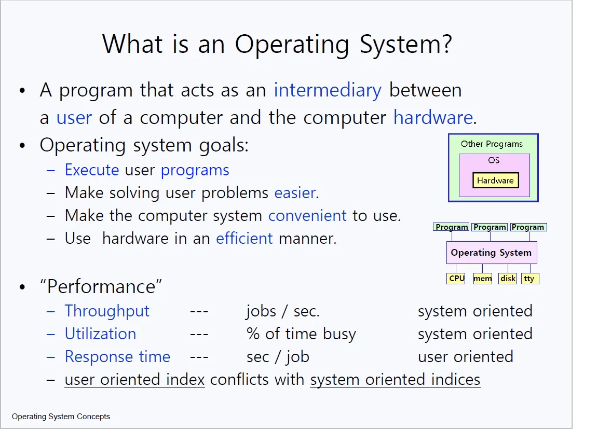
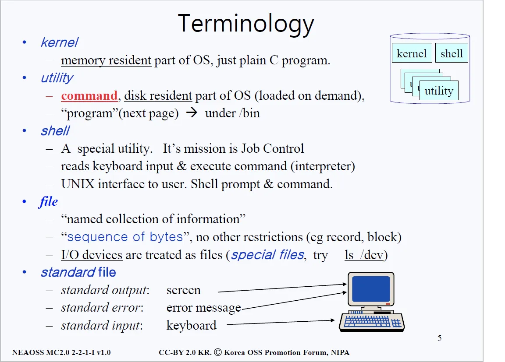
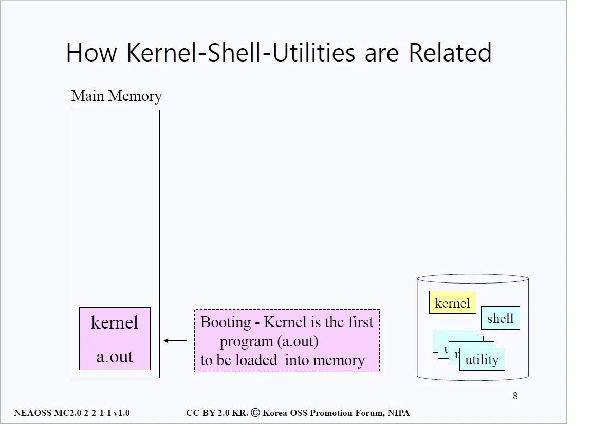
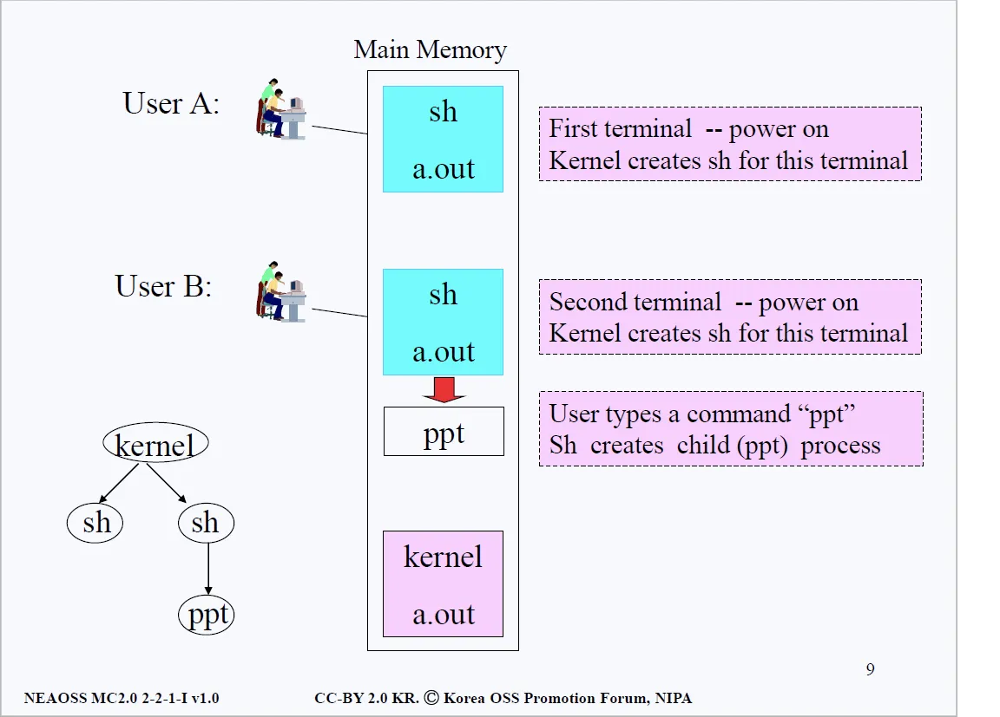

# 운영체제란?
> 하드웨어 자원들(cpu, memory, disk, tty)을 관리하고 프로그램들을 지원(support) 해주는 것

- 다르게 표현하면 하드웨어를 감추고 겉으로 다른 프로그램들을 지원해준다고 생각할 수 있다. 
- 하드웨어를 감춘다는 건, 프로그램을 사용하는 사람이 편하게 쓸 수 있게 각종 기반 작업을 지원한다는 것으로 이해할 수 있다.
- ex) 일반적으로 파워포인트나 워드를 사용할 때 프로그램이 cpu와 memory와 어떻게 소통하는지 등에 대해서 따로 신경쓰지 않는다. 이는 다 운영체제 덕분이다.

## 1. 프로그램이란?
- 프로그램이란 main() 함수를 포함하여 그 외 다양한 기능들을 하는 함수들이 모인 존재라고 생각할 수 있다. 
- 함수들이 적혀 있는 소스 코드 파일을 컴파일하면 프로그램이 된다는 것을 우리는 알고 있다.

### 왜 대부분의 프로그램은 분리되어 있는가?
- Q. Office관련 프로그램을 통틀어 우리는 Microsoft Office라고 부르기도 하는데, 왜 Microsoft사에서는 왜 하나의 Office 프로그램이 아니라 여러 프로그램(Word, Powerpoint)으로 분할해놨을까?
- 하나의 커다란 프로그램으로 운영할 경우 발생하는 비효율성 때문이다. 거대한 프로그램은 실행할 때 부팅 시간도 오래 걸리고 메모리 사용에 있어서도 심각한 비효율성을 초래한다.
- __위와 같은 이유로 리눅스 운영체제 또한 Kernel, Shell, Utility 등 여러가지 프로그램으로 나뉘어져 있다.__

## 2. 커널이란?

- 커널은 'Memory Resident'로써 메모리에 항상 상주해야한다.
- 커널이 아닌 다른 프로그램들은 메모리에 있어도 되고 없어도 된다. ‘Disk Resident’라고 표현한다. 필요할 때마다 메모리에 로딩해서 사용하면 된다는 의미다.
- 커널은 ‘Memory Resident’특징을 제외하곤 아주 평범한 C program이다. 
- 커널을 제외한 다른 프로그램들을 우리는 Uitility라고 하는데 위에서 언급했듯 disk resident하다. 항상 현 주소가 disk라는 의미다. 유저가 필요할 때 요청을 하면 그 때 메모리에 올라오는(로딩되는) 것이다. 그런 의미에서 Utility를 우리는 Command라고도 칭한다.

## 3. 쉘이란?
- 우리 디스크에는 수많은 프로그램들이 존재한다. 이 프로그램들이 언제 메모리에 로딩되고 언제 메모리에서 해제되는지 누가 관리해줄까?
- 위의 필요에 의해 탄생한 것이 쉘이다. 많은 프로그램들의 메모리 교통 정리를 해주는 역할을 한다. 유틸리티 중 하나로 쉘의 1차적인 임무는 ’Job control’이다. Utility, Command, Job을 동의어로 생각하고 공부하자.

## 4. 파일(file)이란? (유닉스에 한정함)
- 유닉스(Unix)에서 파일은 sequence of bytes를 의미한다. 말 그대로 바이트들의 배열이란 뜻이다. 모든 함수, 명령어들은 결국 기계어로 해석하면 0과 1의 나열에 불과하다.
- 특히 유닉스, 리눅스에서는 I/O device도 file로 취급한다. 당장 이해가 안되겠지만, 입출력 기계들(하드 디스크, USB, 키보드 등)을 파일로 취급한다고 알고 있으면 된다.

## 5. 커널과 쉘, 그리고 유틸리티의 관계

- 맨 처음 시스템을 부팅하면 제일 먼저 메인 메모리에 Kernel(a.out)이 올라온다. 커널 실행파일이 메모리에 로딩된다는 말이다. 
- 리눅스는 멀티 유저 시스템으로 하나의 시스템에 다양한 유저가 들어온다는 사실을 상기하고 아래의 그림을 살펴보자.

- 유저가 터미널에 전원을 키면 그 터미널 위에서 쉘(shell)이란 프로그램이 메인 메모리에 올라온다. 
- 그 후 쉘은 유저가 키보드로 커맨드를 입력하기를 기다린다. 유저가 커맨드를 입력하면, 쉘은 커맨드에 대응하는 유틸리티를 디스크로부터 가져와서 실행시킨다. 
- 각 유저로부터 전원이 들어올 때마다 이 3개의 프로그램(커널, 쉘, 유틸리티)의 관계가 형성됨을 알 수 있다.

#### Q. 그런데 키보드로 커맨드를 입력하길 기다리고 그에 대응하는 유틸리티를 디스크로부터 가져와 실행시킨다는 것이 무슨 말일까? 
- 이 말의 의미를 이해하기 위해서는 리눅스가 멀티유저 시스템이라는 점과 CLI(Command Line Interface)라는 점을 상기해야 한다. 더 자세한 설명은 계속해서 나오니 따라가보자.
- 위 내용들을 다시 한 번 정리하자면 이렇다. 커널은 운영체제이며 항상 메모리에 상주해 있다. 나머지 프로그램들은 전부 유틸리티이며 디스크에 상주한다.
- 유틸리티는 항상 디스크에 있다가 필요할 때마다 메모리에 올라오고 사용하지 않을 때는 다시 내려간다. 유틸리티를 우리는 커맨드라고도 칭하며 커맨드들의 교통정리를 하는 것이 쉘의 역할이다.
- 쉘한테 우리가 ppt라고 커맨드를 입력하면 쉘은 child process로 ppt를 생성한다.

## 6. 터미널과 콘솔
- 콘솔은 전통적으로 보면 계기판과 입력장치의 모음과 비슷한 것들의 집합으로 컴퓨터를 조작하기 위한 조작부라고 생각하면 된다.
- 옛날 대형컴퓨터는 serial(rs232, 422, 485)를 이용하여 터미널이라는 장치와 연결하여 조작하였고, 아직도 몇몇 은행에서는 이러한 장비들을 볼 수 있다. 
- 터미널이라는 장비는 CRT와 키보드로 구성되어 있으며 Teraterm, 넷텀, 하이퍼터미널과 같은 프로그램들은 모두 터미널 에뮬레이터라고 불렸다. 
- 이들은 일반 PC를 터미널 대용으로 사용할 수 있도록 해주는 역할을 한다. 터미널을 통해 콘솔과 통신한다라고 생각해보자.
- 이해를 쉽게하기 위해 터미널은 콘솔의 부분집합이라고 생각하는 것도 좋다. 리눅스에서 콘솔과 터미널은 거의 동일한 의미로 사용되고 있다고 볼 수 있기 때문이다.

