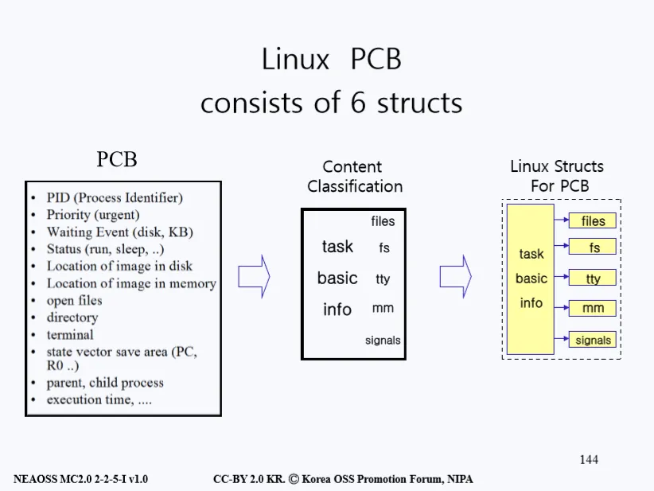
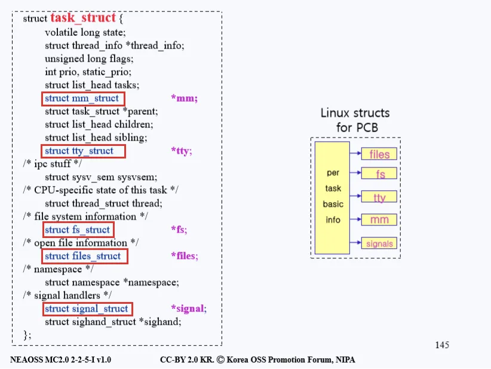
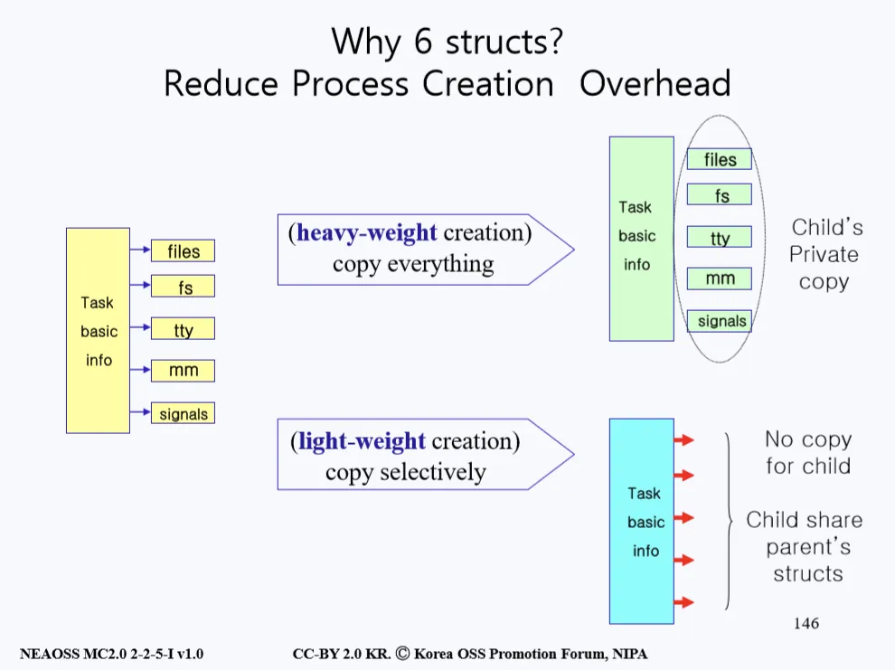
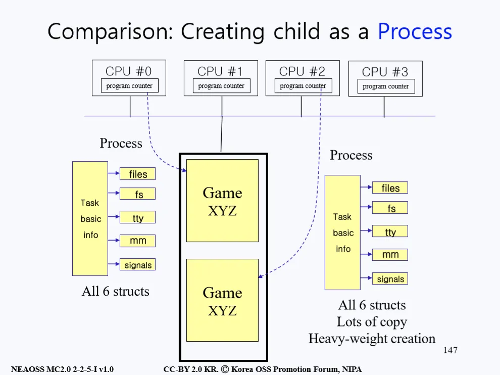
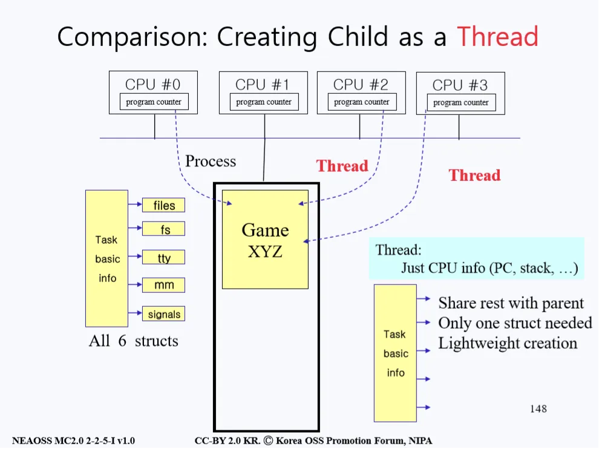
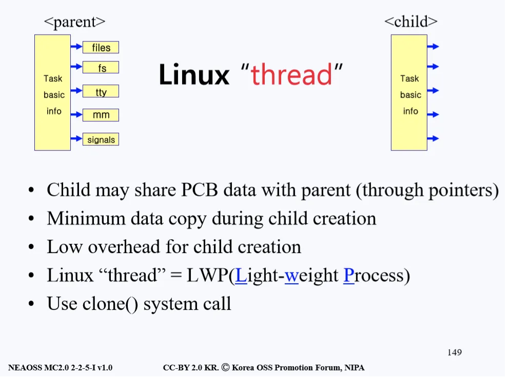
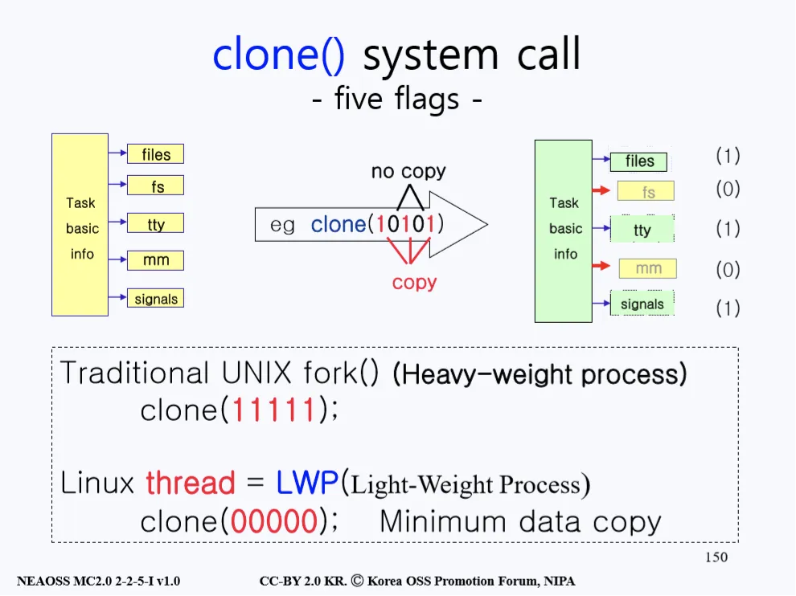

# Process Create
- 부모 프로세스가 자식 프로세스를 만들어 내는 작업을 할 때는 두 번의 오버헤드(overhead)가 발생한다. 
- 이 오버헤드들은 fork()를 하는 도중 발생하며, 첫 번째 오버헤드는 부모 프로세스의 이미지를 자식에게 복사할 때 생기고 두 번째는 부모 프로세스의 PCB를 자식 프로세스에 복사하며 생긴다.

> 오버헤드 : 어떤 처리를 하기 위해 들어가는 간접적인 처리 시간, 메모리 등을 말한다.

## 리눅스의 PCB와 Thread

