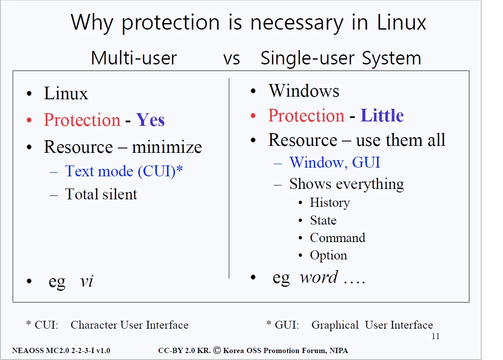
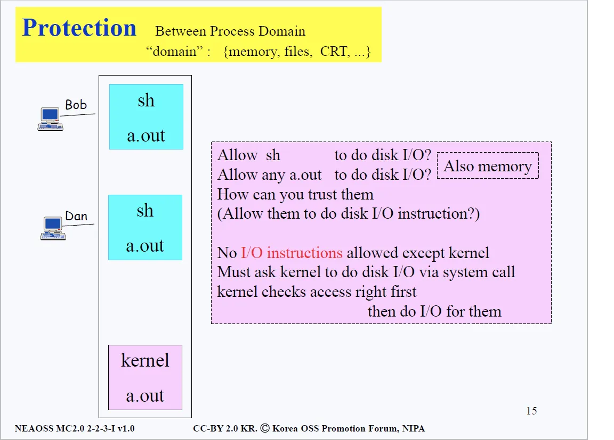
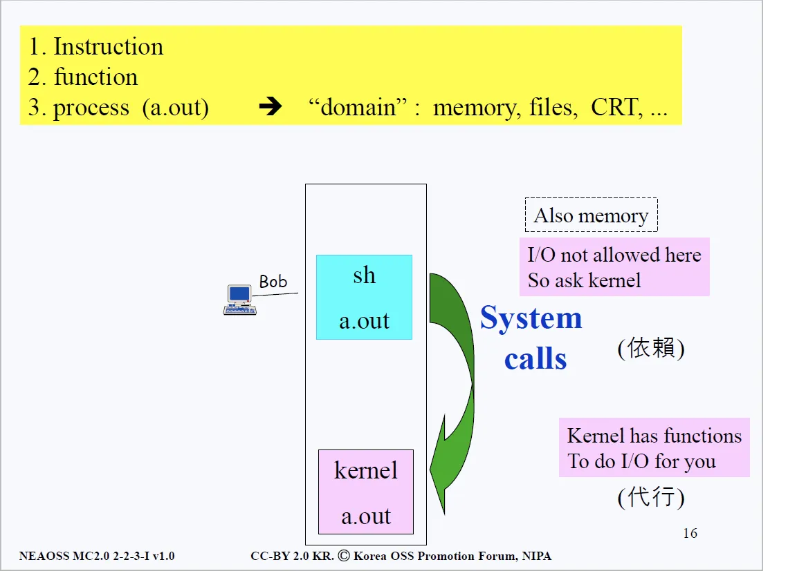
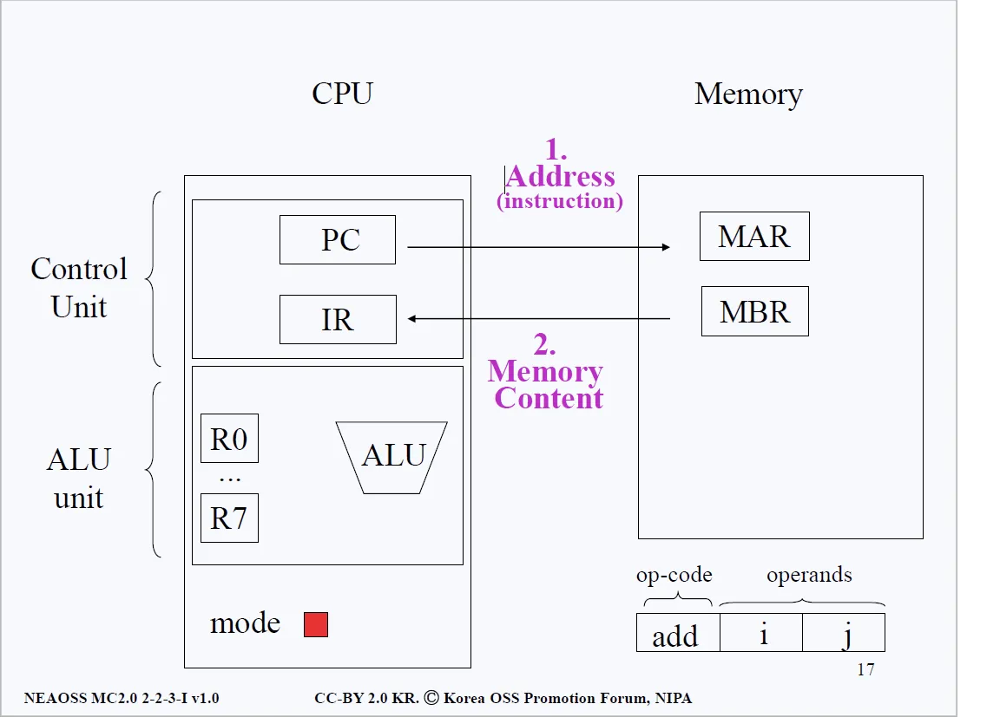
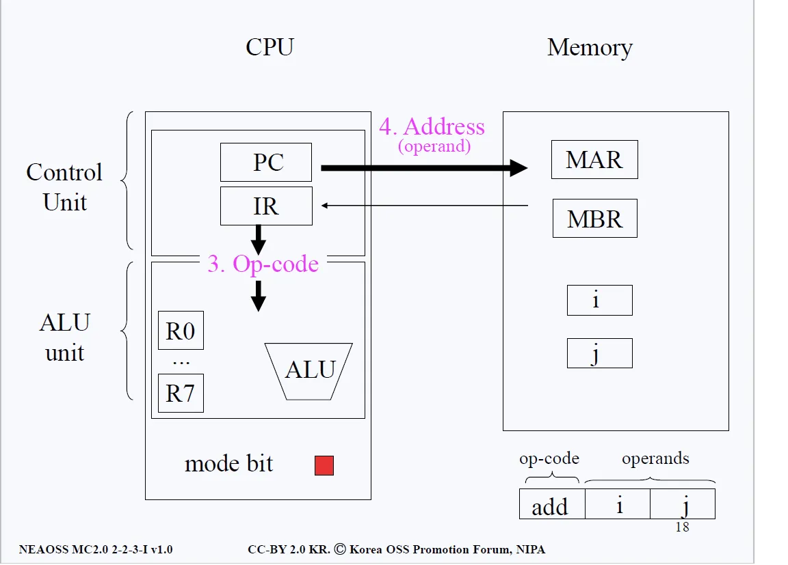
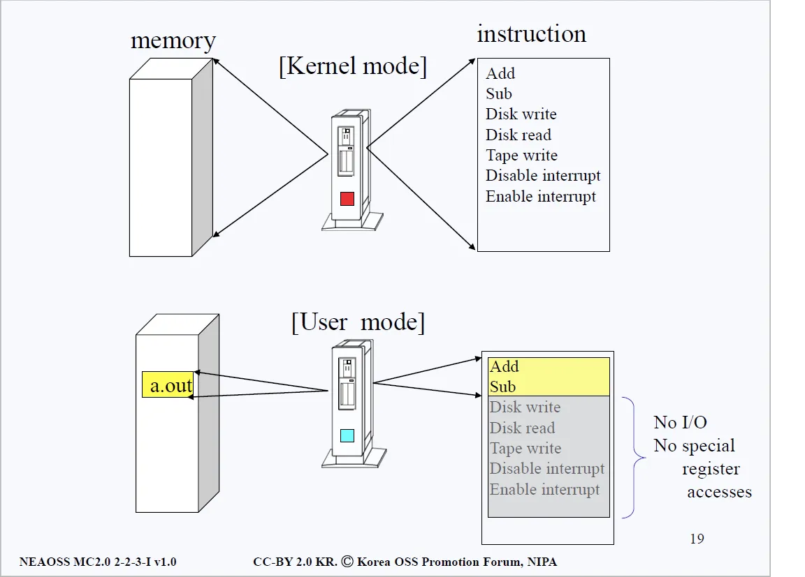
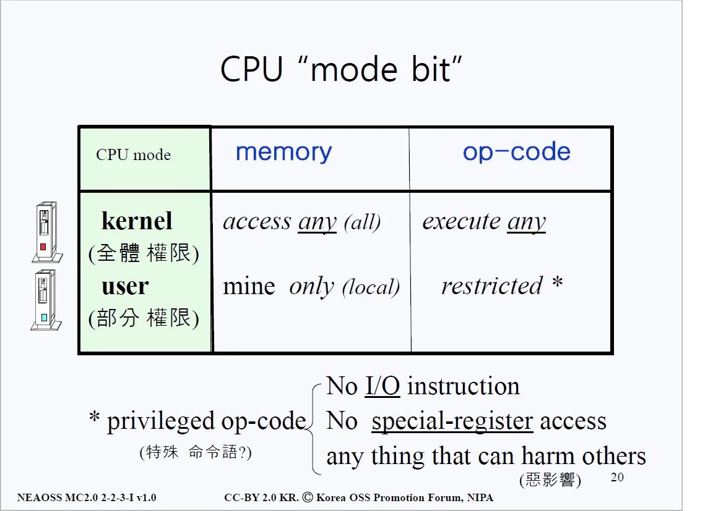
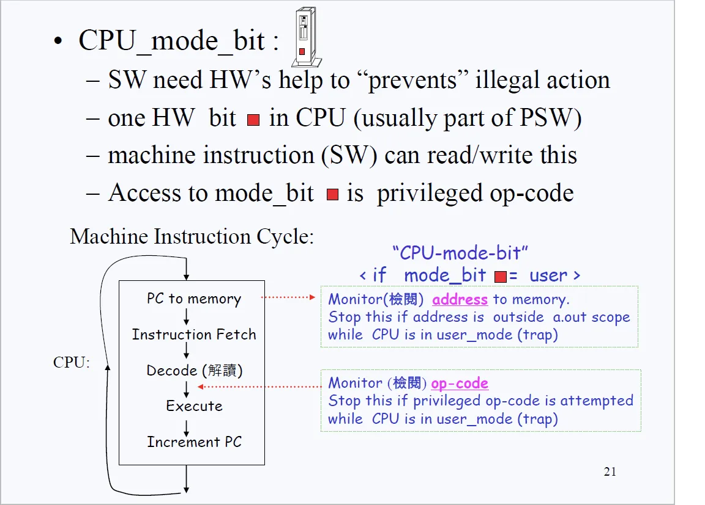
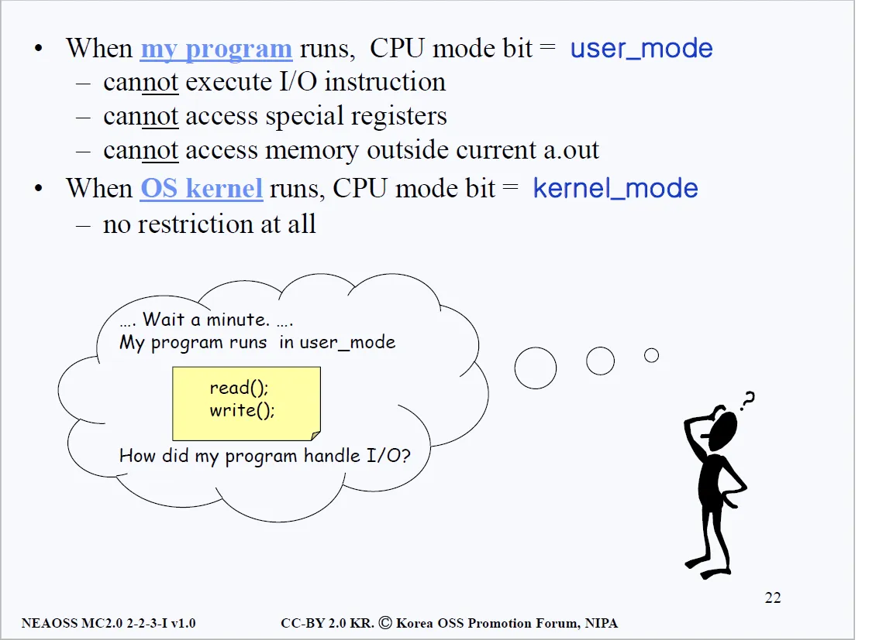

# 리눅스 vs 윈도우
## 1. 자원의 소모에 관하여
- 윈도우는 개인 컴퓨터(Personal Computer)에 사용되는 운영체제다. 개인 컴퓨터에 쓰인다는 것은 나홀로 사용자라는 것, 즉 싱글유저 시스템이라는 의미다. 리눅스가 멀티유저 시스템으로 만들어진 것과는 상반된다.

- 멀티유저 시스템일 때는 보안에 특히 신경을 써야한다. 이유는 간단하다. 멀티유저 시스템은 내 파일 뿐만 아니라 다른 사람의 파일 또한 존재하기 때문이다. 내가 다른 사람의 파일을 멋대로 읽고 쓸 수 있다면? 삭제하고 변경할 수 있다면? 문제이다.
- 또 하나의 이슈는 메모리 관리다. 멀티유저 시스템에서는 한정된 자원을 모두가 효율적으로 이용해야 하기 때문에 메모리 관리가 상당히 중요하다. 반면 윈도우와 같은 싱글유저 시스템에서는 멀티유저 시스템만큼 메모리 관리에 신경을 덜 써도 된다.

### 윈도우
-  PC(Personal Computer)는 일찌감치 윈도우 운영체제와 함께 결합된다. 윈도우는 GUI(Graphic User Interface)를 채택하고 있기 때문이다. 
-  일반 사용자 입장에서 화면에 일일이 키보드로 명령어를 입력하는 것보다 마우스 몇 번 클릭해서 프로그램을 실행하고 관리하는 것이 훨씬 편하기 때문이다.
-  윈도우는 사용자에게 편리한 인터페이스를 제공하는 대신, 동일 작업 대비 훨씬 많은 자원을 요구한다.

### 리눅스
- 반면 리눅스, 유닉스 등의 멀티유저 시스템은 CLI(Command Line Interface)를 채택한다. 
- 윈도우에서는 내가 사용할 수 있는 유틸리티(프로그램, 커맨드와 동의어)가 아이콘으로 보기 좋게 화면에 표시되는데, 리눅스는 man이라는 명령어로 내가 사용할 수 있는 커맨드가 무엇인지 알아내거나 사전에 알고 있어야 원활한 사용이 가능하다.
- 리눅스는 사용자에게 다소 불편한 인터페이스를 제공하는 대신, 화면에 표시되는 Char(1 단위당 1바이트)만큼의 자원을 쓰는 등 효율적인 자원 사용을 가능하게 한다.

## 2. 보안 이슈에 관하여
- 만일 한 프로세스가 다른 프로세스의 정보를 함부로 I/O 하려고 하면 어떨까? 즉, 다른 프로세스의 파일을 삭제하거나 내용을 바꿀 수 있다면? 그것만큼 끔찍한 일도 없을 것이다.
- 이러한 보안문제를 해결하기 위해 리눅스에서는 사전방지(Prevent)하기 위해 많은 노력을 하게된다.
- 우리가 시스템을 설계하는 입장이라고 생각해보자. 알다시피 한 시스템에서 CPU는 모든 프로그램이 공통적으로 사용하는 공용 자원이다. 메모리에 존재하는 프로그램은 여러가지이고 하나의 프로그램만이 한 번의 순간에 CPU를 온전히 차지한다.
- CPU는 한 순간에 하나의 연산밖에 못한다. 즉, 한 순간에 CPU를 사용하는 건 오직 하나의 프로그램 뿐이다.

### 이슈 예시

- CPU가 Bob의 터미널과 연결된 쉘에게 양도되었다고 생각하자. 즉, 시스템이 Bob의 터미널과 연결된 쉘에 CPU를 넘겨준 것이다. 
- 쉘도 하나의 프로그램이므로, 쉘에 버그가 생겼다고 가정해보자. 본래 쉘은 Bob이 접근 가능한 디스크 영역, 메모리 영역에만 데이터를 읽고 써야하는데, 디스크의 Sector Address를 잘못 계산해서 Dan의 영역에 데이터를 썼다고 가정해보자.
- Dan이 저장해 놓은 파일들이 다 엉망이 됐다는 뜻이다. 시스템은 이미 CPU를 Bob과 연결되어 있는 쉘에게 양도를 해놨고… 이 쉘은 잘못을 저질렀다. 
- 해당 프로그램의 오류로 엉뚱한 곳에 데이터를 읽거나 쓰는 상황이 발생했는데 어떻게 이러한 상황을 예방할 수 있을까?

### 이슈 해결

- 위의 그림에도 써져 있지만 리눅스 시스템 설계자가 고안한 해답은 바로 "I/O instruction 하지마!"다. 만약 쉘을 포함한 다른 일반 프로그램이 I/O를 수행하는 순간 CPU 사용권한을 바로 뺏겨버린다.
- 쉘(sh)입장에서는 한편으론 억울할 수 있다. 쉘은 CPU를 사용할 수 있고, 쉘의 역할은 I/O를 하는건데 말이다. 자신의 임무를 수행하려 했더니 억울하게 CPU를 뺏겨버리니 말이다.
- 그래서 리눅스 시스템 설계자는 "그럼 니가 I/O 할 때 커널에게 부탁을 해." 라고 쉘에게 말한다. 
- 즉, 현재 리눅스 시스템의 작동은 I/O instruction을 할 때는 커널이 갖고 있는 function에 부탁을 하는 방식으로 되어있다. 이 부탁하는 과정을 System call이라 한다.
- 커널은 해당 입출력 명령이 합법적인 것인지 검사한 후에 I/O를 대신 진행해준다. 이런 특별한 구조를 구축하기 위해 윈도우나 개인 컴퓨터에는 없는 개념을 하드웨어에 도입한다. 아래의 그림을 살펴보자.

### mode bit 도입

- 위 그림에 빨간색 네모칸이 바로 그 bit(비트)다. 이 bit를 mode bit라고 한다. 
- 비트라는 건 알다시피 2개의 데이터(0과 1)만을 저장할 수 있다. 0은 유저모드를 의미하고 1은 커널모드를 뜻한다.
- CPU의 Control Unit 파트에 PC는 Program Counter라고 하는 특수 레지스터이다. PC에서는 이번에 수행해야 할 instruction(명령)의 주소를 메모리로 보낸다. 
- MAR은 Memory Address Register이며 Address Bus라고도 이해할 수 있는데, MAR이 읽어들인 주소에 해당하는 데이터를 MBR(Memory Buffer Register)에 담아 IR(Instruction Register)에 보낸다.
- IR로 들어온 Instruction(명령)은 위 그림의 우측 하단과 같은 구조를 지닌다. 
- op-code에는 수행해야 할 명령이 적혀있고 그 옆에는 operands라고 하는 명령 인수들이 적혀 있다. i와 j 주소에 있는 값을 더하라는 의미로 해석할 수 있다.

- Op-code를 읽어들여 명령어를 처리하는데, i와 j에 해당하는 메모리 주소에 담겨 있는 값을 알아내기 위해 또 다시 메모리에 접근해서 연산을 진행한다.

### mode bit 추가설명

- 만약 모드 비트가 커널모드(1)로 되어 있다면 CPU는 어떠한 영역의 메모리라도 접근할 수 있다.
- 커널모드가 아닌 유저모드로(0)로 되어 있다면 모든 메모리에 접근(Access)은 불가능하고 자신의 Address Space만 접근 가능하다.
- 또한, 커널모드(1)일 경우에는 모든 instruction이나 op-code를 수행(execute)할 수 있지만, 유저모드(0)라면 I/O instruction이나 special register accesses와 관련된 instruction은 금지된다. 
- 즉 유저모드에서는 타인에게 큰 영향을 줄 수 있는 instruction은 모두 거부되는 것이다.

### memory vs op-code

## 3. 커널모드와 유저모드
- CPU는 항상 address를 메모리에 건넨다. 원하는 instruction이 있다면 해당 instruction의 주소를 Program Counter가 메모리로 보낸다. 
- 이 과정이 CPU가 메모리에게 "이 instruction을 수행해야 하니 메모리에 관련된 코드를 주세요"라고 말하는 과정이며, instruction이 오면 그것을 실행(execute)하는 과정에서 매개변수(operands)에 관련된 주소를 보내고 정보를 받아온다.
- 이처럼 CPU는 계속 메모리에게 address를 보내는 작업을 진행하는 것인데, CPU가 메모리로 주소를 보낼 때는 그 당시 모드 비트가 어떤 것으로 되어 있느냐가 정말 중요하다. 먼저 아래의 그림을 살펴보자.

- 위의 그림은 빨간색 모드 비트가 유저모드였을 경우를 상정하고 설명을 한다. 앞에서 인천 공항 검색대로 예시를 들었었는데, 운영체제에 빗대서 다시 정리해보자. 먼저 첫 번째 보안 검색(address)을 진행한다.
- CPU와 메모리 사이에는 MMU(Memory Management Unit)이라는 하드웨어가 존재한다. 이 MMU의 역할은 CPU로부터 메모리로 가는 address 정보를 조사하는 것이다. 즉, CPU가 메모리에게 넘기는 address 정보가 접근 가능한 메모리 범위를 벗어나지는 않는지 판명한다.
- 첫 번째 검사를 무사히 통과하면 Instruction Fetch, 즉 instruction을 가져온다. 위에서 우리는 instruction의 구조가 op-code, operands로 구성된다는 것을 확인했는데, 바로 이 op-code를 보고 아 이것이 덧셈이구나, 뺄셈이구나, 곱셈이구나 등을 확인하게 된다.이게 바로 2번째 검사다.
- 명령어(op-code)를 확인해 봤는데, 만약 이것이 privileged op-code(I/O와 같은 중요한 역할을 하는 실행)을 시도하려 한다라고 판단되면 그 순간 바로 CPU를 뺏겨버린다.
- 이렇게 작동을 한다면 위에서 언급한 보안이슈를 만족할 수 있다. illegal access가 사전에 예방(prevent)이 되고 차단이 될 수 있다.

- 정리하자면 모드 비트가 유저모드일 때, CPU가 접근하는 메모리 주소가 실행 중인 프로그램의 범위 밖이거나 I/O instruction등의 금지된 실행을 하려고 한다면 CPU를 운영체제로부터 박탈당한다. 
- 반대로 커널모드였을 경우는 위에서 언급한 검증 절차를 전혀 밟지 않아도 된다.
