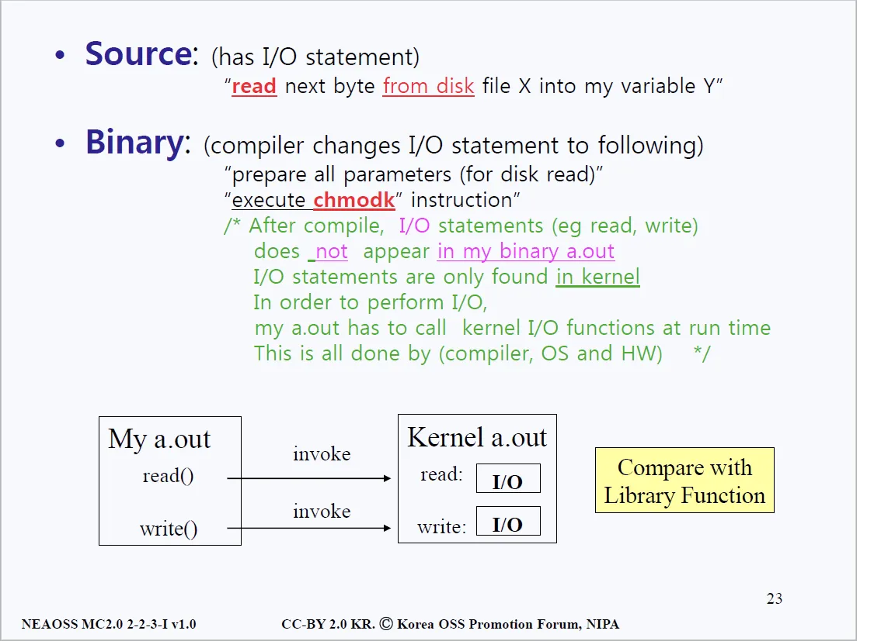
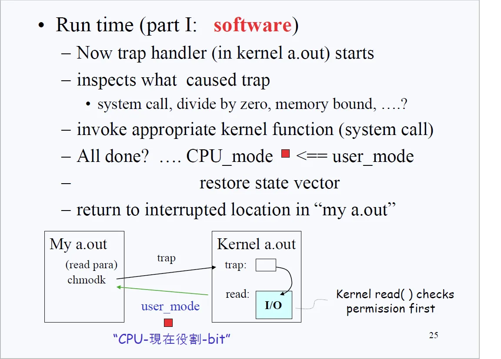
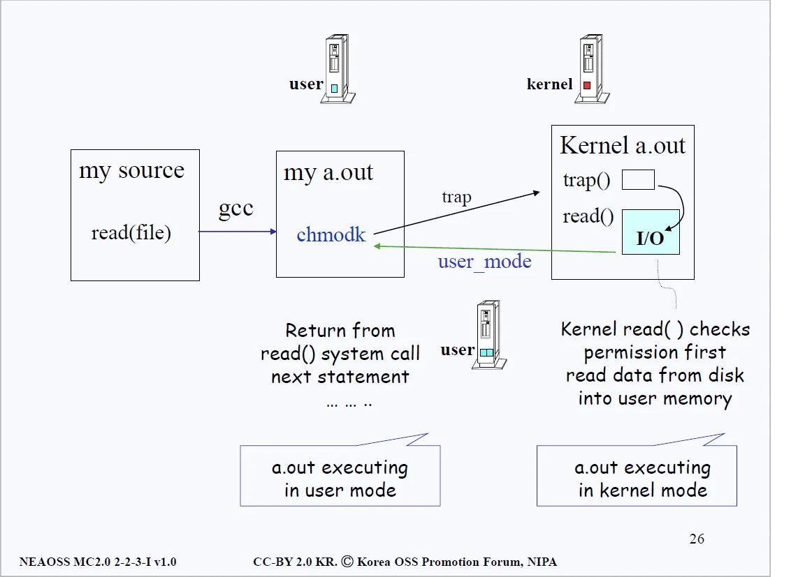
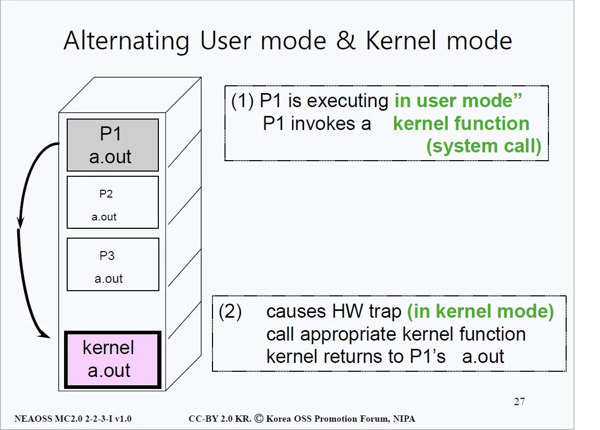
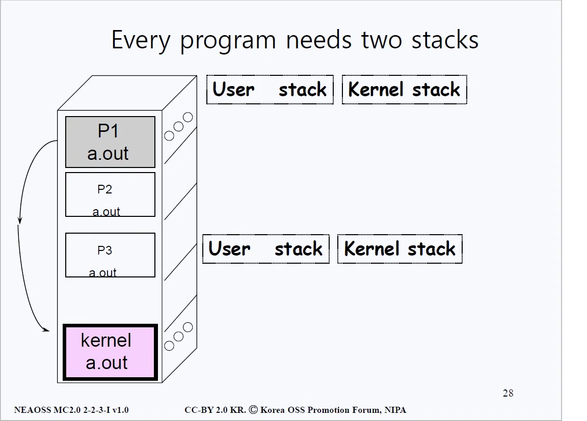
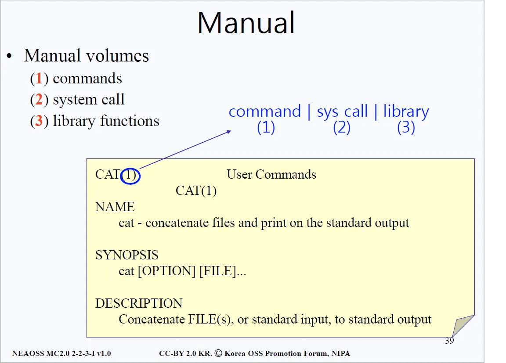

# printf() 함수
## 개요
- 우리는 프로그램을 만들 때 소스 코드에 입출력과 관련된 함수를 작성한다. (ex. printf(), get() 등) 
- 우리가 작성한 코드와 프로그램은 유저모드에서 아무런 제약 없이 사용할 수 있었는데, 왜 I/O가 금지되었다고 말을 하는 것일까?
- 정답은 소스코드에서만 그렇게 보인다 이다. 소스코드에서는 개발자가 입출력을 관리하는 것처럼 보이지만, 소스코드를 컴파일한 후에 바이너리 파일을 열어보면 I/O와 관련된 instruction은 전혀 존재하지 않는다.

- 위에서 언급했듯이 I/O를 하고 싶으면 커널이 가지고 있는 function을 호출하는 방법밖에 없다. 즉 커널에 부탁을 해야한다는 말이다. 그 행위를 시스템 콜(System call)이라 한다.
- 그런데 의문점이 하나 있다. 함수를 호출한다는 건, 특정 기능을 호출한다는 건 내 프로그램 안에 있는 함수를 호출하는 개념인 것인데, 어떻게 다른 프로그램(커널)의 함수를 호출하는 것일까?
- 그 원리는 우리가 입출력 함수를 담은 소스코드를 컴파일 했을 때, 해당 부분(입출력 등)이 등장하면 'change CPU protection mode to Kernel' 명령어를 수행하는 것이다. CPU의 모드비트를 바꾸는 것이다.
- 소스 파일에 privileged instruction이 등장하면 바이너리 파일에서 chmodk로 변환된다는 것을 알 수 있다. 그렇다면 이제 하드웨어가 이 명령어를 어떻게 실행시켜가는지 이해해보자.

## chmodk를 실행했을 때 하드웨어에서 벌어지는 일들

- 소스파일에 입출력 파트에 컴파일러가 컴파일 시에 chmodk를 넣어둔 후 발생하는 일은 첫 번째로 유저로부터 CPU를 뺏는다. 더 이상 유저모드에서 실행(run)할 수 없게 만드는 것이다. 그걸 우린 trap에 걸린다라고 한다.
- 트랩에 걸린 후에 트랩을 처리하는 루틴으로 진입하는데, 해당 루틴은 커널 안에서 처리된다. 
- chmodk 명령어를 처리하기 직전에 우리는 시스템 콜과 관련된 parameter를 사전에 약속된 곳에 기록을 해둔다. 왜냐하면 이후 트랩이 명령어를 처리할 때 유저가 어떤 처리(write, read, open, close)를 하려 했는지를 알아야 하기 때문이다.
- I/O와 관련된 디스크와 관련 섹터에 A프로그램에 B 작업을 요청한다는 관련 parameter를 적어두는 것이다. 그럼 트랩핸들러가 그 정보를 확인한 후, I/O 중에서도 read의 요청이구나라는 확인을 하는 것이다.
- 이제 유저가 뭘 처리하고 싶어하는지 알았으니 그냥 진행하면 되는 것일까? 아니다. 유저가 해당 디스크나 메모리 영역에 권한(read, write, execute 중 하나)이 있는지도 확인해야 한다.

> - 커널 function은 라이브러리 function과 다르다. 라이브러리에 있는 함수를 우리가 호출할 때는, 해당 코드가 그대로 우리 소스코드 안에 Copy & Paste 되는반면 커널의 함수를 호출한다는 건 커널에게 부탁을 하고 커널이 해당 함수를 수행해주는 개념이다. 
> - 커널이 메모리에 항상 상주해 있어야 하는 이유 중 하나이기도 하다. 유저가 어떤 함수를 요구할지 모르기 때문에 항시 대기해야 하는 것이다.

- 위의 검증 과정들을 거친 후 read/write 등의 작업이 끝나면 트랩으로 돌아가고, 해당 트랩에서 다시 유저모드로 return된다. 그 때 비로소 유저는 자신이 처리한 작업이 제대로 완료됐는지를 확인할 수가 있다.

- 과정을 한 번 더 간략하게 도식화한 것이 위 그림이다. 
- 소스파일을 컴파일해서 바이너리 파일에 chmodk를 껴넣고, 그로 인해 트랩이 발생한다. 
- 커널 안의 트랩 핸들러는 적절한 검증절차를 거친 후에 유저모드에서 요구했던 작업을 진행한다. 그 후 다시 유저모드로 돌아온다.

- 커널모드와 유저모드 사이의 모드가 바뀌는 과정을 계속해서 반복한다. 프로그램 내에 더 이상 커널에 요구할 것이 없을 때까지 모든 프로그램은 다 유저모드로 run하다가 커널 모드로 run하는 걸 반복한다.
- 그런데 run을 한다는 건 유저 모드 혹은 커널 모드 안에 있는 function을 사용한다는 것인데 function들을 계속 call 했다가 return 하고 call 했다가 돌아오고 하는 과정을 반복한다는 것이다.
- function에는 보통 local variable(지역 변수)들이 있기 마련이고, 해당 지역 변수들이 어디 저장되는지 생각해보자. 
- 일단 지역변수들은 메모리에 언제부터 언제까지 존재할까? 함수가 호출되고 리턴되기까지 존재한다. 따라서 미리 메모리에 담아두는 비효율적인 방법보다는 임시적으로 메모리에 담아뒀다가 삭제하기 용이한 자료구조를 택해야 하는데, 그것이 바로 스택(Stack)이다.

- function이 호출되면 해당 function의 local variable(지역변수)들이 스택에 push(삽입)된다. 지역변수 뿐 아니라 함수가 끝나고 돌아갈 주소(return address)등도 함께 push(삽입)된다. 
- 어떤 프로그램이나 유저모드와 커널모드를 오가기를 반복한다는 점을 우리는 알고 있다.
- 유저모드에서 유저만의 function들을 실행하고 리턴하기 위해서 유저모드에도 스택이 필요한 것이고, 커널모드도 마찬가지로 자신만의 function을 실행하고 리턴하기 때문에 스택이 필요하다.

## 추가 advice (man 명령어)

- 리눅스 운영체제를 사용할 때 man명령어를 정말 많이 사용하게 될텐데, 각종 명령어를 모를 때 man <command>방식으로 원하는 명령에 대한 상세 정보를 확인할 수 있다. 
- 명령어 우측 괄호 안에 있는 숫자가 해당 명령어가 커맨드, 시스템 콜, 라이브러리 함수인지를 분간해준다.
