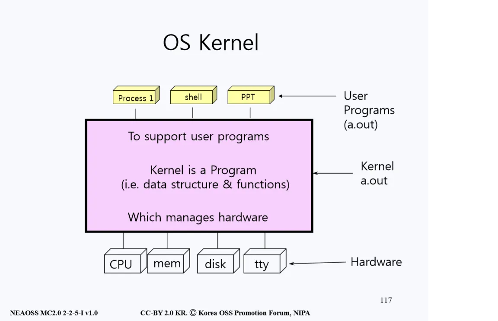
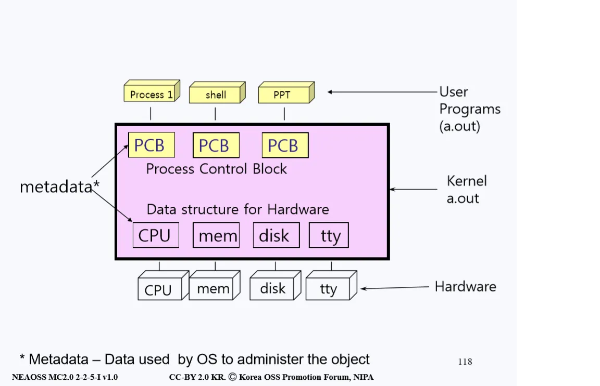
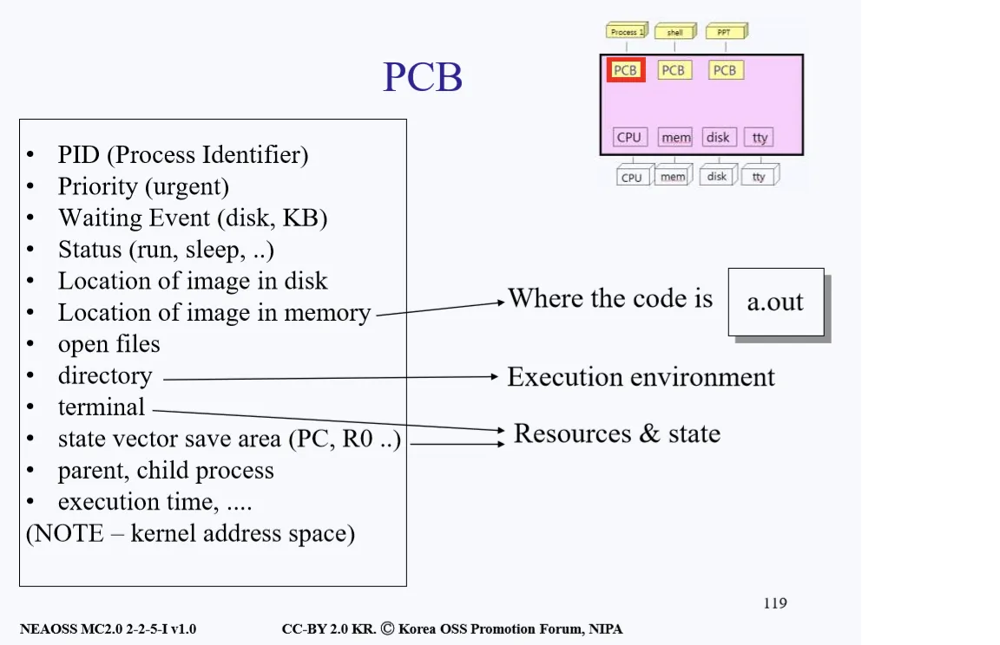
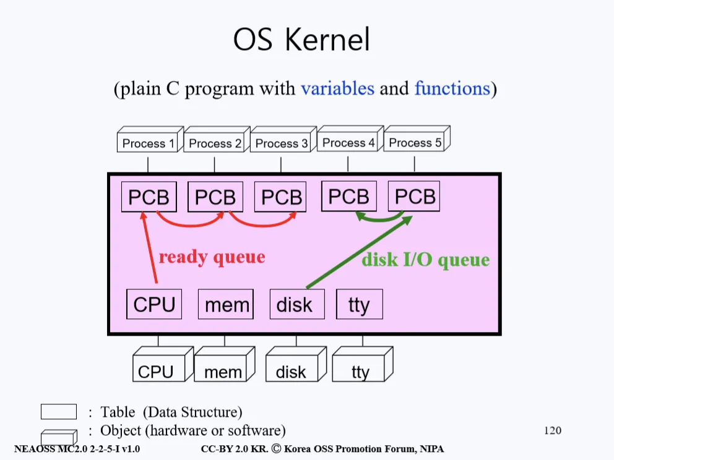

# Process Management
> 커널이 하는 중요 임무 중 하나

## OS Kernel
- 운영체제는 하드웨어 자원을 관리하고 프로그램들을 지원해주는 역할을 한다.

<p align="center"></p>

- 이와 마찬가지로 운영체제의 핵심인 커널 또한 같은 역할을 한다. 위 그림을 살펴보자. 커널은 위로는 프로그램들을 지원하고 밑으로는 하드웨어(CPU, Memory, Disk, TTY)를 관리하는 데이터와 기능들을 가지고 있는 프로그램이다.
- 효율적인 하드웨어 관리와 유저 프로그램을 지원하기 위해 커널은 자체적인 Internal Data Structure을 가지고 있다.

<p align="center"></p>

### Data Structure
- 하드웨어 관리를 위한 Data Structure 안에는 각 하드웨어에 대한 정보가 담겨있다. 
- 예를 들어 Memory 하드웨어에 관한 Data Structure mem에는 이 Memory의 크기가 어느정도이며 어디서부터 어디까지 메모리가 사용되고 있는지 등 관리를 위해 필요한 내용들이 담겨있다.
- 하드웨어 뿐만 아니라 프로세스들을 관리하기 위한 Data Structure 또한 존재한다. 
- 우리는 이러한 Data Structure를 __PCB(Process Control Block)__ 이라 부른다. 즉 프로세스를 지원하고 관리하기 위한 정보들이 담겨있는 데이터 구조체이다.
- 위에서 설명한 프로세스와 하드웨어를 관리하기 위한 데이터가 담겨있는 데이터 구조체를 통틀어 메타데이터(metadata)라고 부른다.

### Metadata
- metadata에는 다음과 같은 내용등이 담겨있다.

<p align="center"></p>

- PID(프로세스 식별자)
- 프로세스의 우선순위
- 대기 현상 (디스크를 읽고 쓰는 등 입출력 작업에는 waiting이 일어난다.)
- 프로세스의 상태 (동작 중인지, 수면 중인지)
- 디스크 내 이미지의 위치
- 메모리 내 이미지의 위치(메모리 안에 코드가 저장되어 있는 위치)
- 열린 파일들(유닉스에서 파일은 바이트의 연속이고 각종 디바이스 또한 전부 파일로 취급한다. 참고로 제일 먼저 오픈하는 파일은 키보드와 스크린 파일이다.)
- 현재 프로세스가 실행되고 있는 환경에 대한 정보
- 터미널
- 상태 백터 저장 공간 (state vector save area 라는 용어 자체에 친숙해지는 것이 좋다.)

> - 만약 프로세스 A가 CPU를 점유하고 있다가 디스크에 용무가 생겨 디스크에게 갔는데 디스크가 먼저 들어 온 일을 처리하고 있었다면 기다림(waiting)을 신청하고 디스크가 작업을 끝내기를 기다린다. 
> - 현실 세계에서는 대기 시간이 고작 몇 초도 안 걸리는 작업이라고 생각할 수 있지만 CPU 입장에서는 매우 긴 시간이므로 A가 기다리는 동안 A가 점유하던 CPU를 다른 프로세스에게 주게 되는데 이때 A가 하고 있던 작업 내용을 A의 PCB(Process Control Block)에 저장을 한다.
> - 이때 이 저장 공간을 state vector save area 라고 한다. state vector save area는 Register들을 저장하고 있는 공간이다. 
> - Register라는 건 State of Flipflop(0과 1)이 32개가 모여있는 집합이다. 프로세스의 상태들을 저장한다고 이해하면 된다.

- 부모, 자식 프로세스
- 실행 시간

### State Vector Save Area
- 프로세스 A의 기다림(waiting) 신청이라는 개념이 무엇이고 커널 내에서 어떻게 동작하는 걸까?

<p align="center"></p>

- 우리는 은행에 가서 일을 처리하려 할 때 이미 창구에 다른 사람이 먼저 일을 보고 있으면 번호표를 뽑고 기다린다. 이처럼 프로세스 또한 본인이 사용하고 싶은 하드웨어가 이미 다른 프로세스에 의해 사용되고 있으면 대기표를 뽑고 기다려야 한다.
- 프로그램적으로 위 과정을 이해해보면 다음과 같다. 

```
1) 프로세스가 자신의 PCB에 사용하고 싶은 하드웨어에 대한 링크를 걸어놓고 Waiting Queue(대기열)에 들어가게 된다. 
2) 만약 본인 앞에 다른 프로세스가 똑같은 하드웨어를 사용하려고 이미 Waiting Queue에 있는 상황이라면 
  먼저 기다리고 있던 프로세스의 뒷 순서로 Waiting Queue에 들어간다.
```

- 이런 Waiting Queue중 CPU에 링크를 걸어놓고 기다리는 것을 ready queue라고 하고 디스크에 링크를 걸어놓고 기다리는 것을 Disk I/O queue라고 한다.


