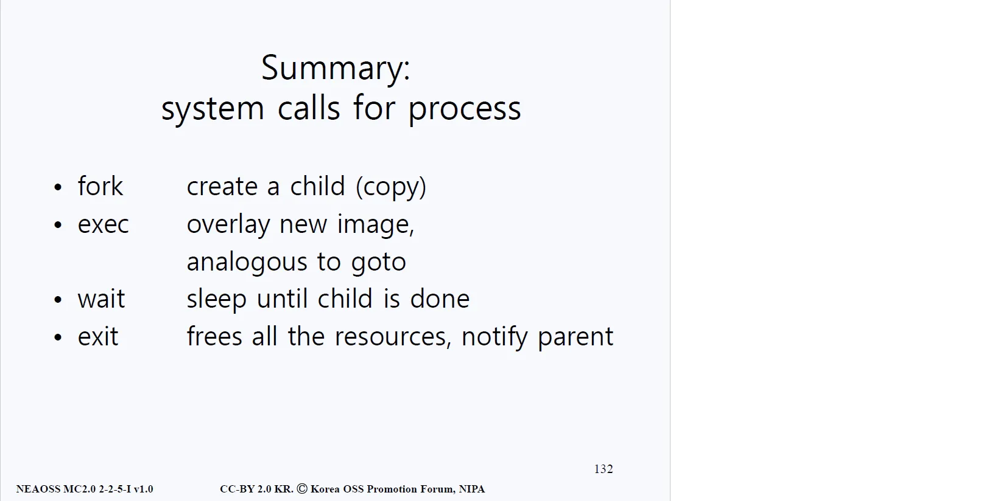
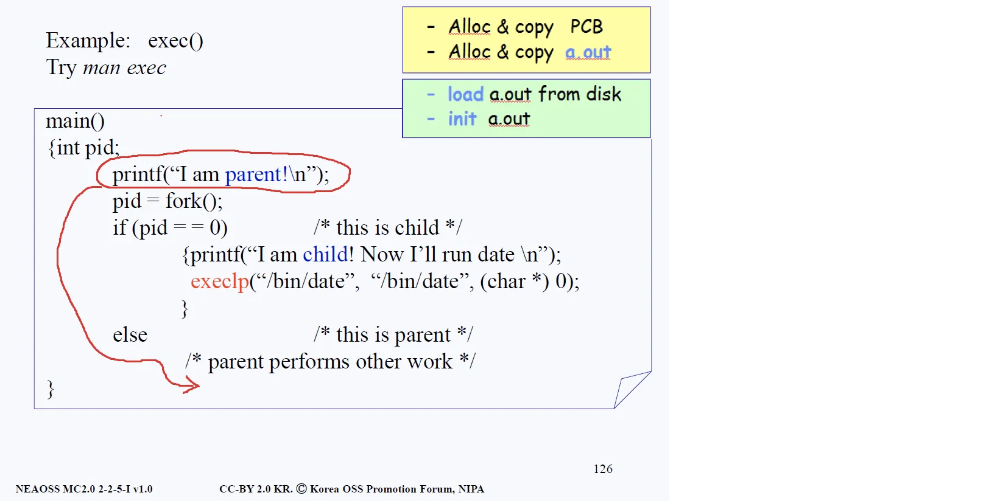
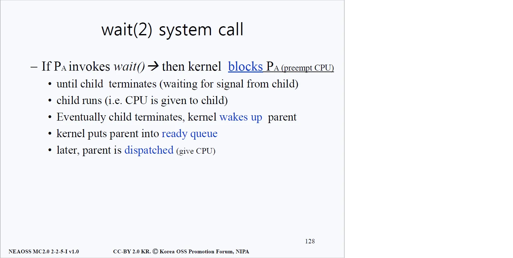
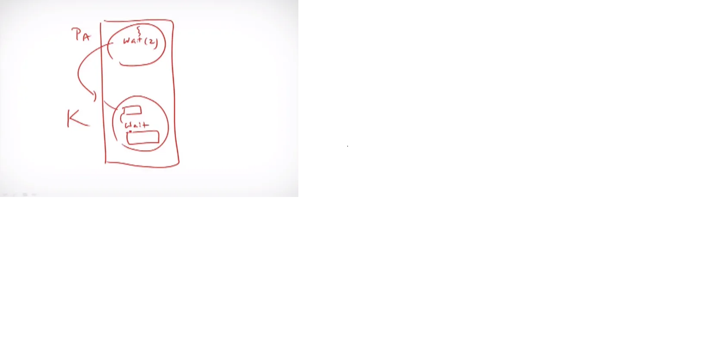
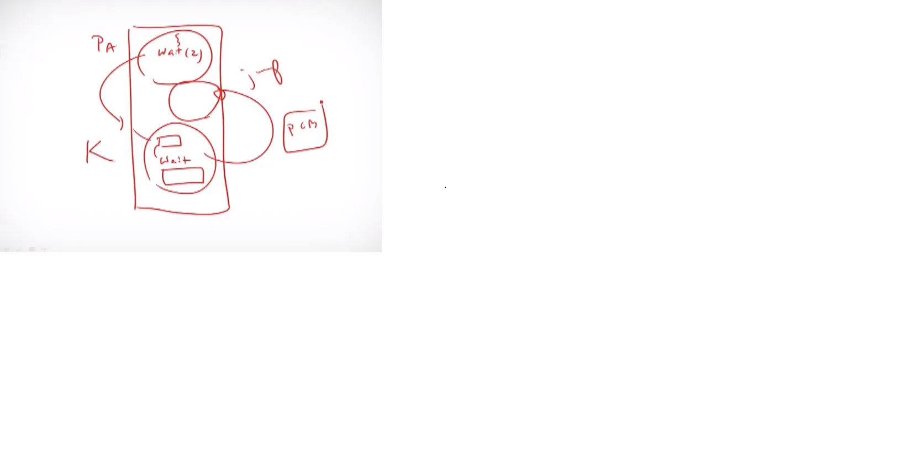
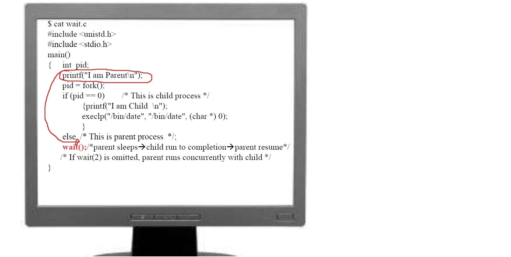
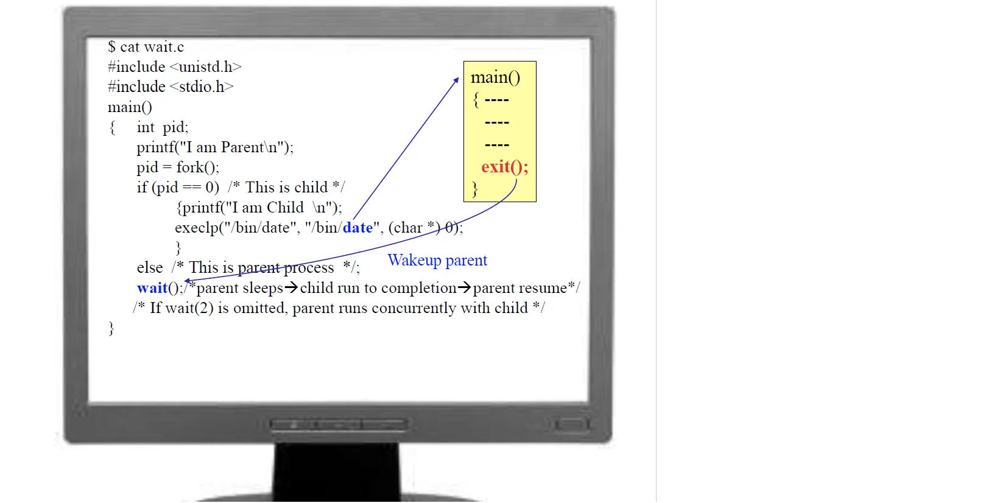
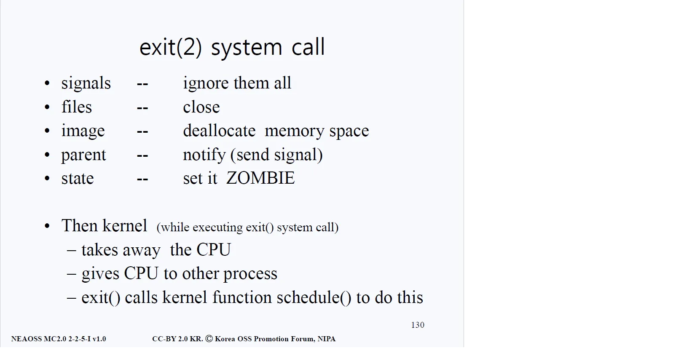

# 시스템 콜 4가지 

- 앞의 child process 생성에서 fork()에 대해 알아보았다.
- 이번 문서에서는 fork() 이외의 시스템 콜인 exec(), wait(), exit()을 정리한다.
> - exec() : 진행 중인 프로세스 위에 새로운 프로세스 이미지를 덮어씌운 후 main()으로 간다. 
> - wait() : 이 시스템 콜을 호출한 프로세스를 잠들게 만듦
> - exit() : 가지고 있던 모든 자원을 반환하고 부모 프로세스에게 알려준다.

## Exec(2) 동작 원리

### 배경 지식
- 먼저 exec()에 매개변수를 살펴보면 /bin이 보인다. /bin은 바이너리(binary) 파일만 모아둔 폴더(directory)를 의미한다. 
- 그 폴더 안에는 바이너리 프로그램들이 수십 개가 존재하고 있는데, 그 바이너리 프로그램 마다 원래는 a.out의 형식으로 되어 있지만 그 이름을 각자의 프로그램 제작사의 입맛에 맞게끔 설정해 놓았다.(ls, cat, hwp, ppt 등)

### 원리
- 코드를 살펴보면 자식 프로세스 차례가 왔을 때 'I am child!' 부분의 출력문을 출력하고, execlp(exec 계열 함수)를 실행하게 되어있다. 
- exec 시스템 콜은 현재 돌아가고 있는 프로세스 위에 자신의 프로세스로 완전히 덮어씌워(over write)버린다. 그 후 exec 매개변수로 왔던 그 프로그램의 main( )으로 가는 것이 exec의 작동 원리다.
- 새로운 프로세스가 생기는 것이 아니기 때문에, pid(Process Id)는 변하지 않는다. 다만 프로세스를 구성하는 코드(기계어 코드)와 데이터, 힙, 그리고 스택 영역의 값들이 exec으로 발생하는 새로운 프로그램의 것으로 바뀌게 된다.

### 과정
- exec은 자신의 프로세스를 현재 진행 중인 프로세스 위에 덮어 써버린다. 
- 덮어씀과 동시에 date의 main( )으로 넘어가는 것이고, 그 쪽에서 날짜를 출력해주는 작업을 진행한다. 그래서 유닉스나 리눅스에서는 프로세스의 생성이 fork()하고 exec()을 하는 두 스텝으로 존재한다.
- fork()는 image(= 소스코드)와 PCB를 전부 복사하는데, exec()의 경우에는 현재 image에 새로운 실행코드를 디스크로부터 바이너리 파일 형태로 가져온 후에 현재 image에 덮어 씌우기를 진행하고 자신 프로세스의 main()으로 진행하는 것이다. 
- 한마디로 기존의 작업하던 것을 자신의 프로그램으로 갈아 치우고 자신의 프로그램을 가동시키는 행위라고 할 수 있다.

## Wait(2) 동작 원리

- 시스템 콜은 결국 커널모드로 진입하는 것을 뜻한다. 위 그림을 보면서 wait()에 대해 알아보자. 
- 어떤 프로그램이 wait()를 호출하면 해당 프로그램의 CPU 사용 권한을 박탈한다. 위 그림의 본문 첫 줄에 등장하는 것처럼 프로세스 P_A로부터 CPU 사용 권한을 박탈한다(preempt).

### Preempt (CPU 사용 권한 박탈)

- 임의의 프로세스 A가 wait(2) 시스템 콜을 호출하면 커널모드(K)의 트랩 핸들러(Trap Handler)에 진입하여 wait() 시스템 콜 실행을 하게 되는데, 이 때 시스템 콜을 호출한 프로세스로부터 CPU를 뺏는다(preempt).
- 풀어쓰자면, 커널은 보통 자신의 작업을 다 하고 나면 호출한 프로세스의 유저 모드로 돌아가야 하는데, 유저 모드로 돌아가지 않는다.
- 커널이 아닌 프로그램은 자신의 주소에 한정되어 read, jump 등을 할 수 있지만 커널은 어디로든 가고 jmp(점프)할 수 있다.
- ready queue에 가서 준비된 프로세스 중 우선순위가 가장 높은 프로그램의 PCB를 찾아서 PC(Program Counter)를 알아낸 후에 PC(프로그램 카운터)가 가리키는 쪽으로 가는 것(jmp)이 preempt이다.

### 부모 프로세스의 초점으로

- fork() 이후에 if문을 통과한 후 else문에서 부모 프로세스는 자신의 일을 수행한다. 
- 모든 일을 마친 후 소스코드의 마지막으로 가보니 wait() 시스템 콜을 호출하고 있다.
- wait() 시스템 콜을 호출하면, 부모 프로세스는 자식 프로세스가 끝날 때까지 잠을 잔다(sleep). 
- CPU는 자식 프로세스에게 넘어가고 자식 프로세스는 자신이 할 일을 수행한다. 자식이 하는 일 중에 execlp("/bin/date"...)라는 명령어가 마지막으로 있으니 해당 명령어를 마지막으로 수행하고 자식 프로세스는 중료한다.
- 자식 프로세스가 종료했을 때 CPU는 자식 프로세스로부터 부모 프로세스를 찾는다. 그 후 CPU는 부모 프로세스를 대기명단(ready queue)에 등록시킨다. 
- 이후 부모가 CPU 점유권을 받았을 때, 그 때가 바로 wait() 시스템 콜이 끝나는 지점이다. 부모는 이후 자신의 남은 일이 있었다면 해당 작업을 진행하게 된다.

## Exit(2) 동작 원리
- 메인함수 main()가 끝날 때는 반드시 exit(2) 시스템 콜이 존재한다. 
- 설령 우리가 소스 프로그램을 작성할 때, exit()을 기입하지 않았더라도 컴파일러가 알아서 main() { }의 마지막에 exit(2) 시스템 콜을 삽입하게 되어 있다. 아래 그림을 살펴보자.

- 자식 프로세스(pid: 0)의 작업 중 execlp("/bin/date", ...)가 있고 위에서 배웠듯이 exec(2)계열의 시스템 콜(exec, execv, execlp ...)이 실행되면서 현재 있는 프로세스 위에 인자로 주어진 프로세스(date)를 덮어씌워버린다. 
- 그리고 곧장 해당 프로세스의 main()을 실행시키게 된다. 
- 원래 저 노란 박스(main 함수가 들어 있는)에는 exit()이라는 소스코드가 존재하지 않았다. 
- 하지만 컴파일러가 컴파일을 할 때 삽입을 해줬고, 실제 만들어진 이진파일(binary file)을 열어 보면, exit(2)에 해당하는 코드가 들어있게 된다.

- 이후 들어오는 신호들을 전부 무시해버리고, 파일들이 열려 있다면 파일들을 닫는다. 
- 또한 메모리 영역에서 해당 프로세스가 차지하고 있는 부분(image)을 해제(deallocate)해 버리고, 부모 프로세스에게 통보한다. 
- 그리고 exit(2)을 호출한 프로세스의 상태를 좀비(ZOMBIE)상태로 설정한다.

- 커널에서 일어나는 동작으로는 먼저 exit(2)을 호출한 프로세스의 CPU를 빼앗고, ready queue에 있던 다른 프로세스에게 CPU를 넘겨준다. 
- 이 과정을 스케쥴링(scheduling)한다고 표현하는데, 실제로 exit(2)을 호출하게 되면 커널 안의 schedule() 함수가 호출된다.

