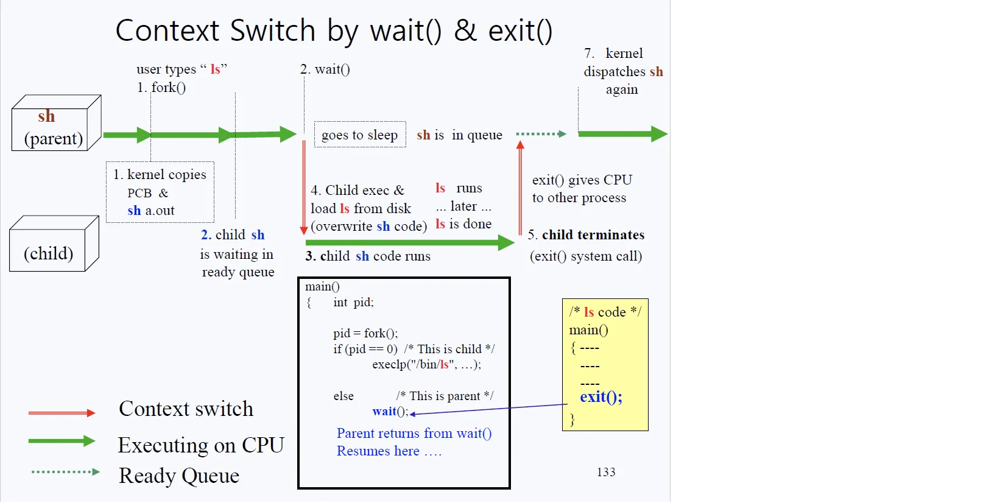
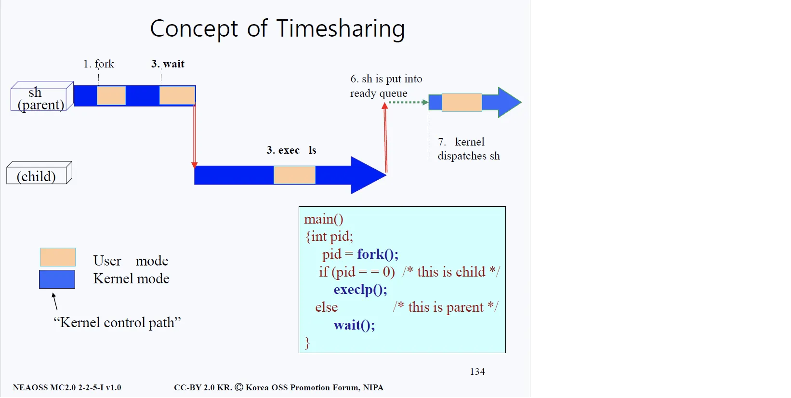
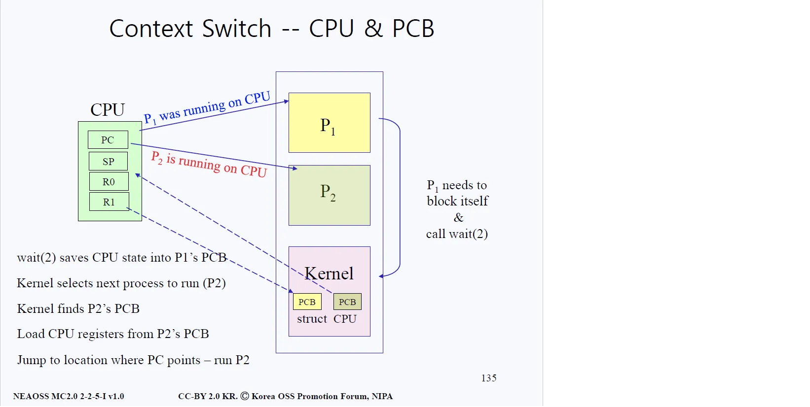
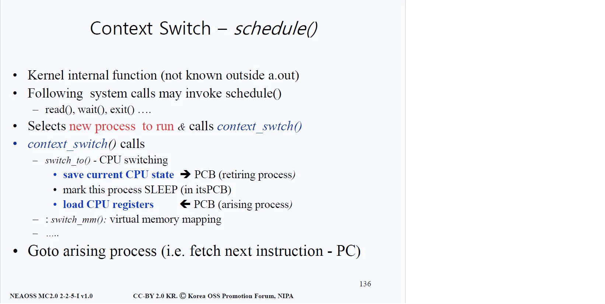

# Context Switch (유저 모드와 커널 모드 사이의 전환)

## 과정

#### 1번
- 유저가 쉘이 띄어 준 프롬프트에 명령어 'ls'를 입력한다. 
- 쉘 입장에서 이 프로세스를 실행시키기 위해서 fork()를 실행한다. 여기서 쉘은 부모 프로세스가 되고 새롭게 생기는 프로세스는 자식 프로세스가 된다. 
- fork()가 동작하면서 쉘의 PCB와 쉘의 a.out(코드)을 그대로 복사한다. 그러나 CPU는 아직 쉘에게 할당되어 있기 때문에 ls가 실행되거나 하진 않는다.

#### 2번
- 부모 프로세스 쉘이 wait()을 호출하게 되고 쉘은 잠들게 된다. 잠들면서 부모 프로세스는 CPU의 대기 리스트(queue)에 들어가게 된다.

#### 3번
- 자식 프로세스는 부모 프로세스와 똑같은 코드 및 상태를 가지고 있으므로 fork() 중간에서 동작하게 된다. 
- fork()로부터 리턴된 값은 자식 프로세스를 뜻하는 pid값 0으로 자식프로세스는 execlp("/bin/ls" ...)를 실행하게 된다.

#### 4번
- 디스크로부터 ls를 로드한다. 자식 프로세스가 기존의 부모 프로세스(쉘)로부터 그대로 복사해왔던 이미지 위에 그대로 덮어씌운다(overwrite). 
- 덮어 씌운 후 ls의 메인 코드로 가서 코드를 실행한다. (ls가 실행된다)

#### 5번
- ls가 끝나면 exit(2) 시스템 콜을 하게 되어 있고, exit(2)을 호출함으로써 다시 커널모드로 들어와서 커널은 CPU를 다른 프로세스에게 할당하게 된다. 
- 이 때 wait(2) 시스템 콜이 끝난 것으로 인지를 하게 된다.

#### 6번
- (그림에는 7번으로 되어 있음) 높은 우선순위를 가지고 기다리고 있던 프로세스가 없다면, 기존의 부모 프로세스(쉘)는 다시 동작하게 된다.

## Timesharing

- 위 그림은 쉘의 유저모드와 커널모드를 왔다 갔다 하는 것을 시간 순서로 도식화해놓은 것이다.

## Struct CPU
> Kernel의 경우 하드웨어를 위한 자료구조, 즉 테이블이 하나 존재하는데 그 자료구조를 Struct CPU라 한다.

- 위 그림의 상황을 보자면, 먼저 CPU가 P1을 실행시키고 있다. 그리고 P1이 wait(2) 시스템 콜을 호출한다. 시스템 콜을 호출하면서 커널은 CPU state vector(PC, SP 등)를 P1의 PCB에 저장한다.
- 이렇게 상태 값을 기억하는 이유는 wait(2) 시스템 콜이 끝났을 때 wait(2)을 호출한 프로세스가 다시 정상적으로 작업을 원활하게 진행하기 위해서다. 
- 보다시피 P1과 P2의 PCB는 커널 코드 안에 있다. 위 그림의 Kernel 파트를 보면, 커널에는 두 종류의 자료구조가 존재한다. 
- P1과 P2에 해당하는 PCB들을 각각 하나씩 가지고 있는데, 커널 안에는 기본적으로 각 하드웨어 자원들마다 자료구조가 존재하고 또한 각 유저 프로세스마다 자료구조가 존재한다.
- P1은 자신의 state vector에 해당하는 값들을 P1에 대응되는 PCB에 저장하고, CPU는 이제 그 다음 실행해야 할 프로세스에게 자신을 넘겨줘야 한다. 
- CPU는 ready queue를 따라가서 CPU를 쓰겠다고 줄을 서 있는 프로세스들의 PCB를 살펴보고 우선순위가 제일 높은 프로세스를 선택한다. 
- 그 프로세스가 동작하기 위해서는 그 프로세스에 해당하는 PCB로부터 레지스터 값들을 가져와서 자신이 가지고 있는 PC, SP 등에 저장해야 한다. 
- CPU 안에 있는 PC(Program Counter)가 P2의 PC로 바뀌었기 때문에 P2의 PC가 가리키고 있는 곳부터 실행(run)된다.

## Schedule 함수
> Context Switch에서 중요한 역할을 맡는다.

- schedule()은 internal 함수이고, Kernel a.out에 알려지지 않는 함수다. 
- internal 함수랑 정반대되는 성격을 가진 것이 바로 시스템 콜이며, 시스템 콜은 커널 a.out에 알려지고 커널 밖에서 부를 수 있다. (커널이 금단의 영역이라면, 시스템 콜은 그 영역에 접근할 수 있는 유일한 방법이다.) 
- 반면에 schedule()은 커널 안에서만 부를 수 있는 함수이다. 즉 유저모드(커널 밖)에서는 요청조차 할 수 없다.

### 과정
- 우선 이 schedule()은 다음에 실행될 프로세스를 찾아 선택한다. 그리고선 context_switch()라는 함수를 호출한다. 
- schedule()은 read(), wait(), exit()과 같은 함수가 호출한다. 
- read()의 경우를 생각해보면, 디스크에 간다고 해서 바로 정보를 읽어올 수 있는 확률은 매우 적기 때문에(다른 프로세스에서도 디스크를 사용중일 수 있기 때문에) 필연적으로 대기하는 시간이 생기게 되는데 이 시간 동안 CPU가 가만히 있을 리 없다. 
- 모든 자원은 제때 제때 효율적으로 사용이 되어야 하기 때문에 CPU를 다른 프로세스에 할당해주어야만 한다. 그래서 read()에서도 switch() 호출이 일어나는 것이다.
- context_switch()를 부르면, 현재 CPU state vector를 은퇴하는 프로세스의 PCB에 쓰고, 새로 등장하는 프로세스로부터 PCB를 로드하고, 해당 PCB의 PC로부터 다시 프로그램을 진행하는 작업을 해준다.
- 즉 schedule()은 CPU의 임자가 바뀌어야 할 때(read(), wait(), exit())마다 불리고, 새로운 임자에게 할당해주기 위한 내부 작업을 진행한다.

