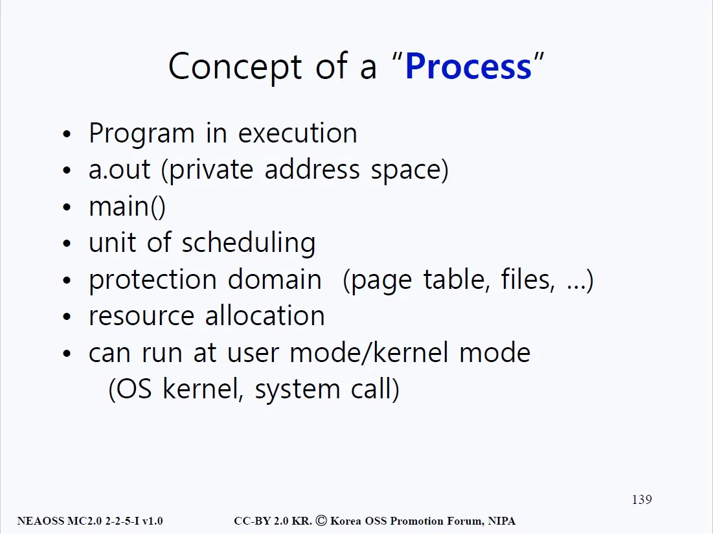

# 중간 정리

## 흐름 정리
- 아래 그림의 분홍색 구간은 커널이다. 커널 안에는 여러가지 시스템 콜이 존재하고 있다. 
- 이 시스템 콜들은 context_switch()와 같은 내부함수와 연관이 있으며 각 하드웨어 자원마다 자료구조가 존재(struct CPU)한다.

#### 1번 
- fork()를 진행하면 커널로 진입한다. 커널에서 fork()는 부모 프로세스와 똑같은 image를 생성한다.
#### 2번 
- 점선으로 표시된 이유는 아직 CPU 제어가 부모 프로세스에 있기 때문에 자식 프로세스로 향하는 선은 점선으로 표시가 되어 있다.
#### 3번
- fork() 작업이 끝난 뒤 리턴한다. 
- 앞서 언급했듯 부모 프로세스에서 fork()를 실행했을 때의 결과값과 자식 프로세스가 실행했을 때의 결과값은 다르다. 
- 일단 첫번째로 리턴되는건 부모 프로세스의 PID가 리턴되므로 else문으로 가서 wait() 시스템 콜을 호출한다.
#### 4번
- wait() 시스템 콜의 요청을 처리하기 위해 또 다시 커널모드로 진입한다. 
- wait()은 CPU를 잠시 포기하겠다는 의미이기 때문에 context_switch() 함수를 실행한다.
#### 5번
- 그림을 정정해야 한다. wait()에서 context_switch()로 가는 것이기 때문에 5번 화살표의 방향은 반대가 되어야한다. 
- context_switch() 함수가 실행되면서, 먼저 CPU에 있던 state vector 영역에 해당하는 정보를 부모 프로세스의 PCB에 덮어 쓴다(저장한다). 
- 이렇게 저장을 해야 후에 자식 프로세스의 작업이 끝나고 돌아왔을 때, 부모 프로세스의 PCB에 저장되어 있는 상태값들을 보고 후에 다시 부모 프로세스로 돌아가서 남은 작업들을 원활하게 처리할 수 있다.
#### 6번
- 자식 프로세스는 애초에 부모 프로세스에서 fork()가 일어나던 시점에 형성된 것이므로, 자식 프로세스의 PC(Program Counter)는 fork() 중간을 가리키고 있었을 것이다. 
- 따라서 제어흐름은 6번 화살표를 따라 fork()로 가게 되고, 자식 프로세스의 시작은 fork()에서 시작되는 것이다.
#### 7번
- 자식 프로세스에서 실행되고 있는 fork()의 리턴 값은 당연히 자식 프로세스의 PID일 것이다. 
- 따라서 자식 프로세스가 실행하기로 되어 있는 exec()이 호출된다.
#### 8번
- exec()이 해주는 작업은 하드 디스크에 저장되어 있는 프로그램 코드(유저가 exec 시스템 콜의 매개변수로 준 프로그램)를 불러들여 현재 진행되고 있었던 프로세스 이미지 위에 덮어 씌우는 작업이다.
#### 9번
- 따라서 디스크에 유저가 exec() 시스템 콜에 매개변수로 넘긴 ls에 해당하는 프로그램이 현재 진행중이었던 쉘(자식 프로세스) 위에 덮어 씌어지게 된다.

## 흐름 정리 (자식 프로세스가 exec() 함수에 의해 덮어씌워지고 난 후)

#### 10번
- 덮어씌어진 후에 ls 프로그램의 main()으로 흐름이 넘어간다.
#### 11번
- ls의 코드가 전부 실행된 후 exit()이 호출되면서 흐름은 12번으로 넘어간다.
#### 12번
- 소스코드 상에 exit()이 존재하지 않아도 컴파일러가 알아서 삽입을 해주기에, exit()을 무사히 실행할 수 있다. 
- exit()은 지금까지 진행중이었던 프로세스로부터 CPU를 빼앗아 다른 프로세스에게 재할당해 주는 과정이 있기 때문에 마찬가지로 context_switch()를 호출하게 된다.
#### 13번
- 자신을 호출한 프로세스로부터 CPU를 빼앗고, ready queue에 가서 CPU를 기다리고 있던 프로세스 중 우선순위가 높은 프로세스를 골라서 해당 프로세스의 PCB 안의 상태값들을 현재 CPU의 레지스터에 복사 붙여넣기한다.
#### 14번
- ready queue에 부모 프로세스만 남아있다고 가정한다면, 부모 프로세스가 선택되어 실행될 것이고 부모 프로세스는 wait()을 진행하고 있었기 때문에 wait() 중간부터 다시 실행된다.
#### 15번
- 14번까지의 작업이 끝났다면 쉘은 다시 사용자로부터 또 다른 명령을 기다리게 된다.

## 용어 정리
### 프로세스 (Process)

- 프로그램이 실행중일 때 우리는 프로그램을 프로세스라 부른다. 
- a.out 형식을 가지고 main() 함수부터 시작하게 되어 있다. 
- 스케쥴링과 보호의 단위이고, 자원을 할당받는 과정을 수반하고 유저모드와 커널모드를 오가면서 진행된다.

### Context

- 유저 영역(user space)의 text는 instruction(명령문)을 의미한다. data와 bss에 대한 설명은 위 그림의 Note 파트에 서술되어 있다. 
- 먼저, 두 개의 배열(array)이 존재한다. A라는 배열은 초기값을 할당해줬고 B라는 배열에는 초기값을 주지 않았다. 
- 만약 배열의 크기가 100만 정도에 전역변수로 선언되어 있다면? A 배열처럼 초기값을 할당 해줬다면 디스크에서 백만 개의 셀을 갖고 있어야 한다(사전에 자원이 지급됨). 
- 만약 초기값을 주지 않았다면 디스크에 실제로 존재하진 않고 해당 배열이 실행 중 로드 될 때만 할당되게 된다.

- 초기에 값이 할당된 부분을 data라고 하며 초기에 할당되지 않은 데이터 부분을 bss라고 한다. heap은 동적 메모리 할당에 쓰여지는 데이터 영역이며 stack은 함수 호출 등에 사용되는 자료구조다.

- 커널 영역(kernel space)에는 PCB와 stack이 존재한다. HW(CPU)쪽에서는 state vector가 존재한다. 이런 것들을 합쳐서 우리는 context라고 부른다.

### Daemon(데몬) 또는 서버
- 서버(혹은 데몬)는 무엇일까? 근본적으로 서버는 a.out(실행 파일)이다. 다만 조금 특이한 알고리즘을 가지고 있을 뿐이다. 아래 그림을 살펴보자.

- 맨 처음 서버 혹은 데몬이 시작되는건 부팅될 때이다. 부팅하고 나서 대부분의 시간은 잠들어 있다. 요청이 올 때만 해당 요청을 서비스 해주고 서비스가 끝나면 또 잠들게 된다. 이런 프로그램을 우리는 데몬 또는 서버라고 부른다. 
- 만약 프린트 서버가 존재한다고 하면, 프린트 서버는 말 그대로 프린트 요청이 올 때만 프린트를 해주고 그 이외에는 잠든다. 네트워크 서버 또한 네트워크 요청(연결, 해제 등)이 올 때만 처리하고 그 이외에는 잠든다.

- 서버라는 것은 하드웨어의 개념이 아니라 소프트웨어의 개념인 것이다. 항상 incoming request가 오는지 안 오는지 지켜보고 있으며 서비스가 올 때만 서비스를 해주게 되어 있다.

- 리눅스 시스템에서 사용되는 명령어 ps(Process State)를 살펴보자. 현재 기기에서 어떤 프로세스가 작동하고 있는지를 나타낸다. 
- -e 옵션의 경우 시스템 프로세스까지 전부 보여주는 명령어다. 웹 서버나 네트워크 서버 등의 모든 시스템 프로세스의 상태를 보여주는 명령어다.

- 보통 데몬이나 서버 프로그램의 경우 이름 뒤에 d자가 붙는다. httpd는 웹에서의 통신에 사용되는 데몬이고, ftpd는 파일전송 서버를 나타내는 등 다양한 서버와 데몬이 존재하고 있다.

