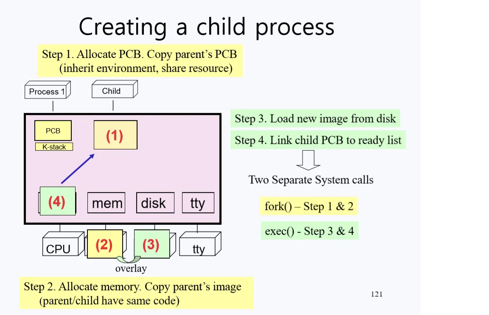
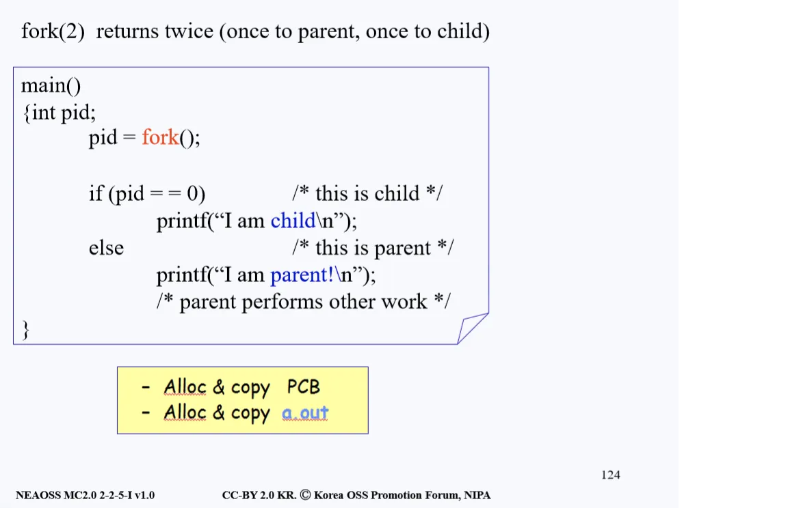
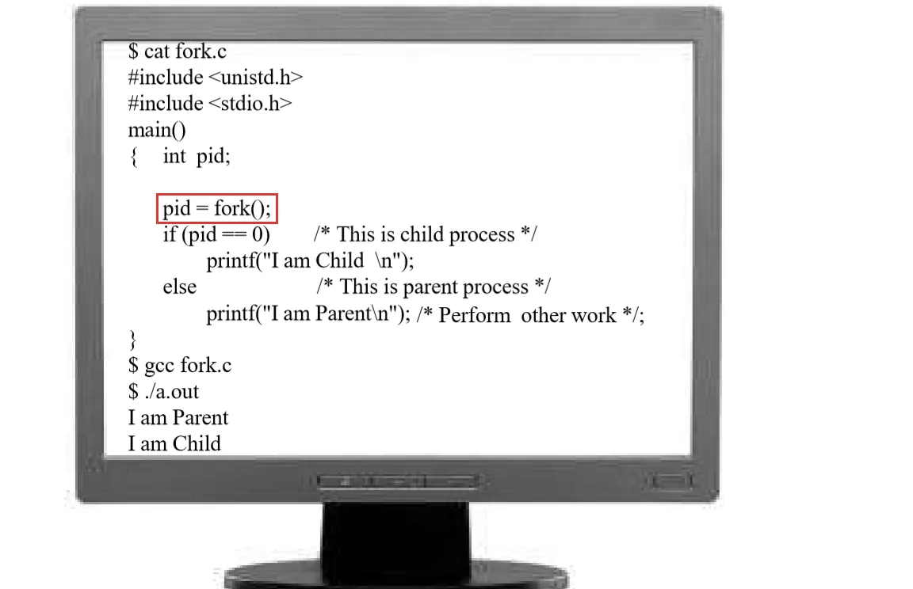
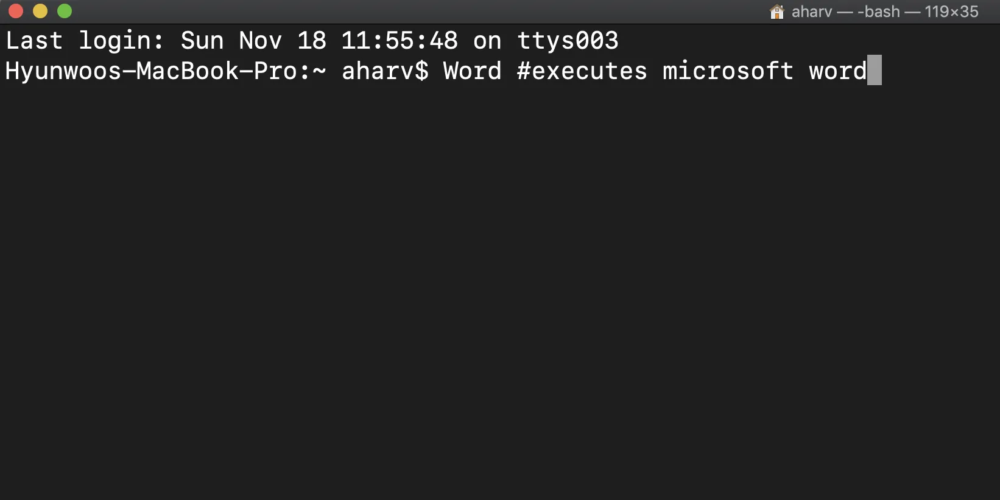

# Child Process 생성
- 컴퓨터를 부팅하면 제일 먼저 커널 프로세스가 로드된다. 그리고 이 커널은 터미널이 켜질 때마다 그에 해당하는 Shell, 즉 Child Process를 만든다. 
- Shell은 사용자의 입력을 기다리고 입력이 들어오면 그에 따른 작업을 수행해주는 프로그램이다. 
- 사용자가 Mail이라고 입력하면 Mail이라는 Child Process가 생성 된다. 이처럼 프로세스들이 진행될 때는 자식 프로세스(Child Process)가 생성되면서 진행된다. 
- 따라서 커널을 공부할 때 Child Process는 반드시 알아야하는 개념이다. 지금부터의 설명은 아래 그림과 함께 살펴보도록 한다.

<p align="center"></p>

> - 프로그램 : 보조 기억 장치에서 실행되기만을 기다리는 정적인 데이터 집합
> - 프로세스 : 프로그램이 명령어와 데이터와 함께 메모리에 적재된 상태, 즉 실행 중인 프로그램

- 프로그램에는 User Stack과 Kernel Stack이 존재한다. 
- User Stack은 프로그램에서 function을 사용할 때 사용된다. 
- Kernel Stack은 유저 모드에서 시스템 콜을 통해 커널의 function들을 사용할 때 필요한 자료구조로 프로그램 실행에 필요한 Local Variable들을 저장하기 위한 공간이다. 
- 만약 자료구조를 가변적인 Stack 구조로 사용하지 않고 늘 공간을 확보해둔다면, 프로그램 크기가 엄청 커지고 운영 비용만 비싸질 것이다.

## Child Process 생성 과정
1. PCB 공간을 만들어 준다. 초기값으로 Parent Process의 PCB를 복사해온다. Parent가 사용하던 Resource(터미널, 키보드, 스크립트)를 자식 프로세스도 사용하게 되는 것이다. Parent Process의 실행 환경이 Child Process의 실행 환경이 된다.
2. Child Process가 들어갈 수 있는 메모리 공간을 확보하여 초기값을 지정한다. 이를 위해 커널은 Memory의 Data Structure에 가서 빈 메모리 공간을 찾아 공간을 지정해준다. 지정된 공간에 Child Process의 값들을 넣기 전에 먼저 Parent Process의 image를 똑같이 복사를 해준다. 이 이유는 후에 등장한다. 프로세스 처리과정을 간편화하기 위해 복사한다고 일단 기억해두자.
3. 디스크로부터 Child Process에 새로운 image를 로드한다.
4. 새로 생긴 Child Process의 PCB를 CPU의 ready queue에 등록하여 CPU를 사용 할 수 있게끔 준비해준다. (아직까지 CPU는 Parent Process가 사용 중이기 때문이다.)

```
1번과 2번의 과정을 Fork라고 부른다. (Parent와 동일한 것을 만든다.)
3번과 4번의 과정을 Exec이라고 부른다. (디스크로부터 새 이미지를 읽어온다.)
```

## Fork
> Fork는 한 번 호출하면 두 번 리턴한다라는 개념으로 기억하자.

- 두 번의 리턴 중 첫 번째 리턴은 Parent Process가 본인이 가지고 있는 Process 상태를 그대로 Child Process에 복사하고 CPU의 ready queue에 Child Process를 등록 시켜놓고 다시 Parent Process로 리턴하는 과정이다.
- 그 후 ready queue에 등록되어 대기 중이었던 Child Process가 CPU를 점유하게 된다. 
- Child Process가 실행되는데, Child Process는 만들어질 당시 Parent Process와 동일한 PCB(Process Control Block) 즉, 같은 State Vector를 가지고 생성되었기 때문에 Fork를 호출하고 난 바로 그 다음 진행 시점에서 실행된다.
- 즉 Child Process는 Parent Process가 가지고 있는 정보들 뿐만 아니라 프로그램 진행 상황까지 완전히 똑같은 상태를 가지게 되고 이런 현상 때문에 Child Process 또한 Fork에서 리턴하게 된다.
- 그렇기 때문에 한번 Fork를 해서 두 번 돌아온다는 표현이 생긴 것이다. 단, 운영체제가 이런 두 가지의 return으로 일어나는 혼동을 막기 위해 리턴하는 값은 다르게 해준다. 지금까지 설명한 과정을 아래 그림과 함께 살펴보자.

<p align="center"></p>

- Fork가 두 번 리턴되는데 한번은 Parent Process로, 한 번은 Child Process으로 리턴한다. 그리고 리턴할 때의 값은 pid 값이다. 
- pid는 Process Id라는 의미로 이는 유닉스 시스템에서 각 프로세스에게 할당하는 고유 식별값이다. 
- pid 값이 0 이라면 Child Process를 의미하고 그게 아니라면 현재 실행 중인 프로세스는 Parent Process다.

> Child Process에게는 0 값을 리턴하고 Parent Process에게는 Child Process의 pid(process id)를 리턴한다.

- 아래의 프로그램을 리뷰하면서 내용을 정리해보자.

<p align="center"></p>

- fork.c라는 이름을 가진 소스파일이고, fork를 호출하는 프로그램이다. 프로그램의 출력 결과를 예상해보고 확인하면서 지금까지 배운 fork를 리뷰해본다.
- fork()를 호출하면 위 그림에 나와 있는 코드가 그대로 복사되어 Child Process에게 할당된다. 하나 더 생성이 되는 것이다. 그럼 Parent Process와 Child Process는 서로 같은 코드와 상태를 가지고 있게 되는 것이다.
- fork() 호출의 리턴값 pid의 값에 따라 Child Process가 실행되거나 Parent Process가 실행된다. 
- 결국엔 둘 다 실행되겠지만 둘 중 누가 먼저 실행되는지 위 코드에서는 정확히 파악하기 어렵다. 보통은 부모 프로세스가 먼저 실행된다.


### 보다 더 자세한 동작 원리

- 위의 소스 코드로 동작하고 있는 프로그램이 쉘(Shell) 프로그램이라고 해보자. 쉘 프로그램은 사용자로부터 입력을 기다리고 입력된 명령을 토대로 프로그램을 실행하는 교통 정리 프로그램이라고 언급하였다. 
- 쉘이 시작되면 명령어를 입력할 수 있는 터미널 혹은 프롬프트 창이 등장할 것이고 쉘은 터미널 혹은 프롬프트 창에 사용자로의 명령이 입력되기를 기다리고 있다. 아래와 같은 화면을 생각하면 된다.

<p align="center"></p>

#### fork() 함수로 인한 자식 프로세스 생성
- 우리가 쉘에 Microsoft의 Word 프로그램을 실행시키는 word라는 명령을 터미널에 입력했다고 해보자. 
- 입력된 명령어를 받은 쉘은 가장 먼저 fork()를 진행한다. fork()를 호출하면 자식 프로세스가 생성되면서 부모 프로세스와 완전히 동일한 소스 코드(image)를 갖게 된다. 코드 뿐 아니라 부모 프로세스의 PCB도 그대로 물려 받는다.

#### 부모 프로세스 진행
- 아직은 부모 프로세스가 CPU를 점유하고 있기에 fork()로부터 리턴된 pid값은 자식 프로세스의 pid값이고 부모 프로세스는 printf("I am parent!\n")을 마저 진행한다.
- 자식 프로세스의 pid값을 리턴받음으로써 부모 프로세스는 자식 프로세스를 알고 통제할 수 있다. 부모 프로세스로부터 복제되어 생성된 자식 프로세스는 ready queue에서 CPU가 자신에게 할당되기를 기다린다.

#### 자식 프로세스 진행
- 이후 CPU의 점유권은 자식 프로세스에게 넘어가게 된다. 이론상 ready queue에 대기하고 있던 다른 프로그램들이 없었다고 가정한다면, 부모 프로세스가 끝남과 동시에 자식 프로세스는 CPU를 쥐게 된다.
- 자식 프로세스는 어떻게 동작할까? 위에서 fork()가 실행되면서 부모의 코드(이미지) 뿐만 아니라 PCB를 통째로 복사했기 때문에 다음에 어디서부터 실행해야할지 알려주는 PC(Program Counter)와 SP(Stack Pointer) 등 또한 복사되었다. 
- 즉 PCB에 존재하는 State Vector Save Area 영역(이하 state vector로 서술함)에 있는 PC와 SP등을 복사했기 때문에 자식 프로세스의 코드가 실행될 때는 맨 처음부터 실행되는 것이 아니라 fork() 중간에서부터 다시 진행하게 되어 있다.
- 대부분의 프로그램은 초기 실행될 때 main()부터 시작한다. PCB에 그렇게 명시되어 초기화가 되기 때문이다. 
- 하지만 지금 다루고 있는 자식 프로세스의 경우는 PCB에서 가리키고 있는 다음 실행주소(Program Counter)가 fork()에 있었기 때문에, 자식 프로세스는 fork() 중간 영역부터 진행한다.


