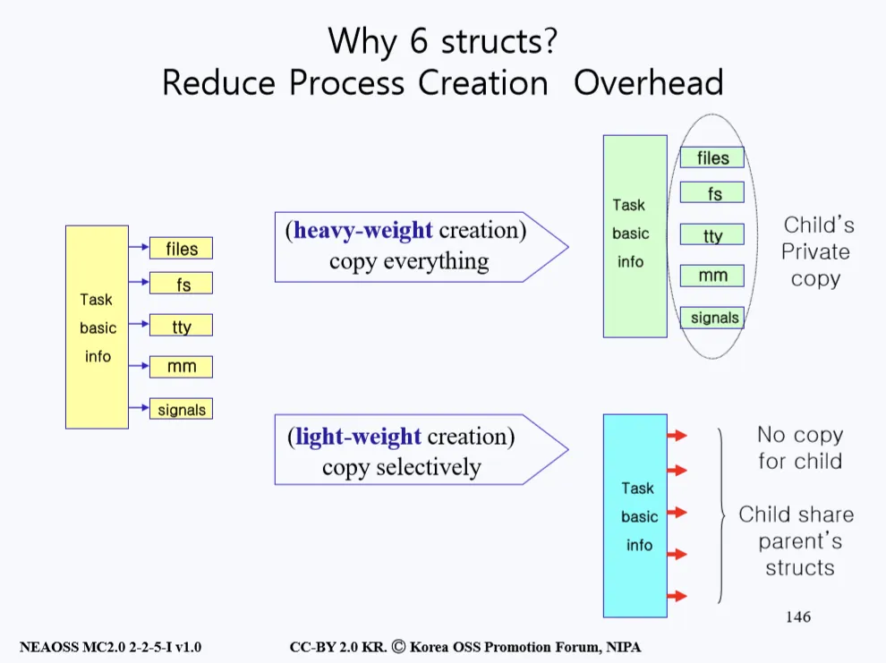
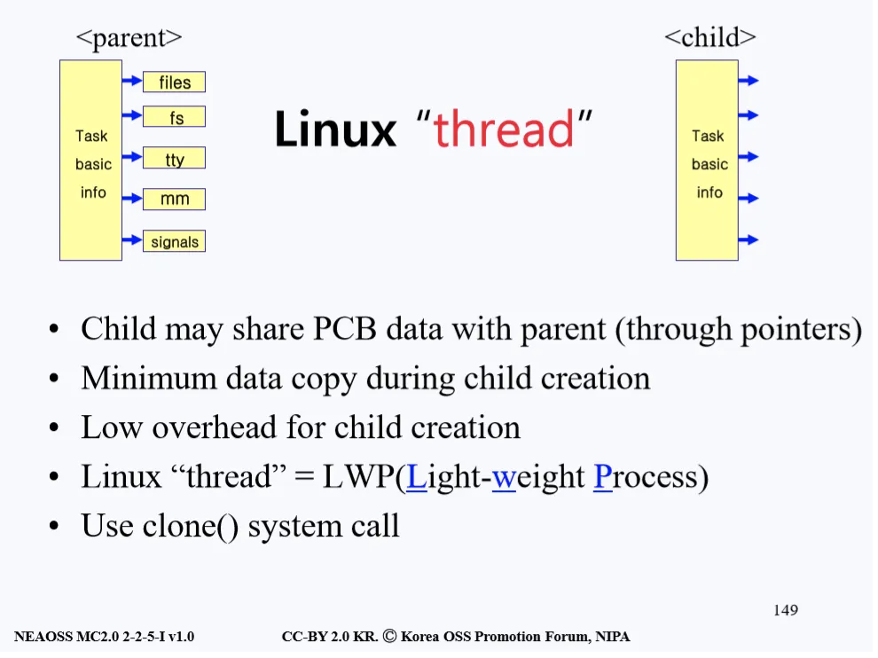
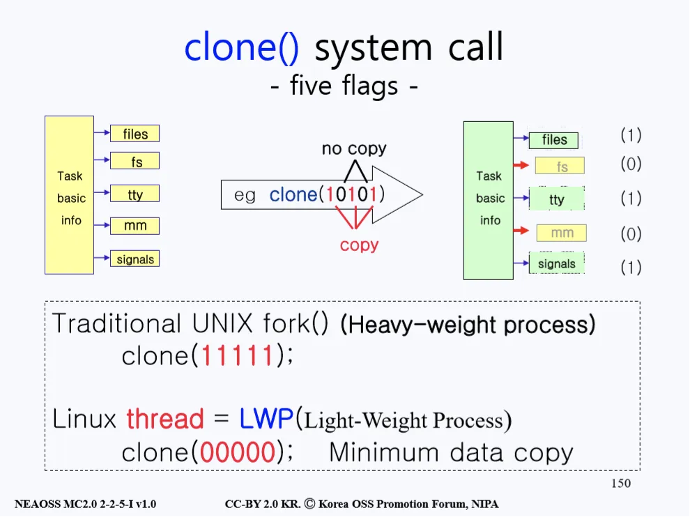

# Process Create
- 부모 프로세스가 자식 프로세스를 만들어 내는 작업을 할 때는 두 번의 오버헤드(overhead)가 발생한다. 
- 이 오버헤드들은 fork()를 하는 도중 발생하며, 첫 번째 오버헤드는 부모 프로세스의 이미지를 자식에게 복사할 때 생기고 두 번째는 부모 프로세스의 PCB를 자식 프로세스에 복사하며 생긴다.

> 오버헤드 : 어떤 처리를 하기 위해 들어가는 간접적인 처리 시간, 메모리 등을 말한다.

## 리눅스의 PCB와 Thread
<p align="center"></p>

- PCB에는 다양한 정보들이 수 킬로바이트라는 꽤 큰 용량으로 구성되어 있다. 
- 이러한 PCB의 내용을 분류를 하자면 
```
1) task basic info 
2) 프로세스가 오픈한 파일들에 대한 정보가 들어있는 file
3) 프로세스가 접근 중인 file system에 대한 정보인 fs
4) 프로세스가 사용 중인 터미널 정보 tty
5) 사용 중인 메인 메모리에 대한 정보 mm
6) 여러 신호 정보인 signals
```
로 나눌 수 있다.

- 리눅스는 이렇게 분류된 요소들을 하나의 구조(Struct)로 묶지 않고 그림 오른쪽에 나와있는 것처럼 6개의 구조로 나눠 관리한다.

<p align="center"></p>

- 먼저 그림의 왼쪽 상자에 나와있는 것처럼 크게 task_struct가 있다. 
- 이건 리눅스가 가지고 있는 PCB인데 그 안에는 여러 개의 struct들에 대한 내용이 있고 그 옆에 보라색으로 \*mm, \*tty 등이 있는 것을 알 수 있다. 
- 보라색으로 표시되어 있는 포인터(\*)를 따라가면 각각이 가리키는 파일, 메모리를 등을 볼 수 있다. 
- 이는 오른쪽 그림에도 나와있는데, 그림을 보면 왼쪽 노란 상자에 task basic info가 있고 그곳에서 화살표로 가르키는 곳을 따라가면 각각의 구조(struct)들이 나온다. 
- 이처럼 리눅스의 PCB는 1개의 구조가 아닌 6개의 구조로 나눠져 있다.


### 리눅스가 PCB를 1개가 아닌 6개의 구조로 나누어 관리하는 이유
<p align="center"></p>

#### heavy-weight creation
- 위 그림의 왼쪽에 있는 노란 상자들을 보자. 저 6개의 상자들이 있어야 하나의 PCB이다. 전에 fork()를 통해 자식 프로세스를 생성하고 이때 부모 프로세스의 정보를 그대로 복사한다고 했는데 그 정보가 바로 위 그림에 나와 있는 정보다.
- 그렇다면 부모 프로세스의 노란색 상자 6개 구성요소가 전부 자식 프로세스에게 복사되는 것일까? 만약 그렇게 fork()가 동작한다면 files, fs, tty, mm, signals 등을 각각 읽고 쓰는데 많은 자원이 사용된다. 
- 모든 걸 복사해서 자식 프로세스를 만든다고 했을 때 부모 프로세스의 PCB 정보를 read()할 때 사용되는 바이트, 자식 프로세스의 PCB에 write()할 때 필요한 바이트가 각각 필요하므로 상당한 부하가 걸린다. 
- 따라서, 이러한 제작 방식을 heavy-weight creation이라 칭한다. 초기 리눅스가 구현될 때는 이런 방식으로 구현되었다고 한다.

#### light-weight creation
- 그러나 막상 시스템을 만들다보니 부모 프로세스가 가지고 있는 tty(터미널)나 fs(파일 시스템)는 자식이 가지고 있는 것과 동일한 경우가 많다. 
- 즉, 복사하는 게 아니라 공유를 할 수 있다. 
- 자식 프로세스에게는 부모 프로세스가 가지고 있는 tty나 fs등의 주소만 알려줘서 같은 자원을 공유하는 방식으로 생성되는 것을 light-weight creation이라 칭한다.
- 자식 프로세스가 부모 프로세스와 다르게 사용할 것들만 선택적으로 복사하자라는 아이디어로 구현한 이 방식은 전부 복사할 때 들어가는 하드웨어 자원과 오버헤드를 최소화시키는 장점이 있다.

### 예시
<p align="center"></p>

> - 프로그램 카운터(Program counter, PC) : CPU 내부에 있는 레지스터 중 하나로써, 다음에 실행될 명령어의 주소를 가지고 있어 실행할 기계어 코드의 위치를 지정한다.
> - 프로세서 레지스터(Processor Register) : 컴퓨터의 프로세서 안에서 자료를 보관하는 아주 빠른 기억 장소이다. 일반적으로 현재 계산을 수행중인 값을 저장하는 데 사용된다.
> - a.out : 과거 유닉스 계통 운영 체제에서 사용하던 실행 파일과 목적 파일 형식. assembler out의 약자이다.

- 위 그림을 보면 정가운데에 검은 네모 상자는 메인 메모리를 뜻한다. 맨 위의 박스들은 여러 개의 CPU를 표현하고 있고 CPU마다 각각 프로그램 카운터를 내장하고 있다. 
- 이런 상황에서 Game XYZ가 실행되고 있다고 가정하자. 
- 이 게임은 지금 CPU #0위에서 실행되고 있고 Game XYZ 프로세스를 CPU #0의 PC(프로그램 카운터)가 가리키고 있다. 
- 그리고 각 CPU를 위해서 PCB가 좌측에 노란 상자로 존재하고 있다. 각 PCB는 6개의 구성요소로 되어 있다.
- 이런 상황에서 자식 프로세스를 전통적인 방법으로 만들었다고 생각해 보자. 
- 그렇게 되면 a.out도 복사하고 PCB도 똑같이 복사해서 자식 프로세스를 만들 것이다. 이렇게 되면 위에서 말했던 것처럼 오버헤드가 발생한다. 

### 오버헤드를 줄이는 법 (light-weight-creation)
<p align="center"></p>

- 오버헤드를 줄이기 위해 고안된 방법이 바로 자식 프로세스를 생성할 때 프로세스로 만들지 않고 Thread로 만드는 것이다. 
- Thread는 모든 구조를 복사해 오는게 아니라 CPU 관련 정보들을 가지고 있는 Task basic info만 복사하는 것을 칭한다. 
- 아래 그림을 보면 자식들은 부모의 구조들을 전부 복사해오지 않고 Task basic info만 복사해 와서 나머지는 부모와 공유해 사용한다. 
- 이러한 방식을 light-weight creation이라고 한다.

<p align="center"></p>

- 위의 내용들을 정리해보면, 리눅스에서 Thread는 PCB에서 Task basic info만 복사해오고 다른 PCB 데이터는 공유를 한다. 
- 덕분에 데이터의 복사는 줄고 자식 프로세스를 만들 때의 오버헤드가 최소화 된다. 
- 그래서 리눅스에서의 Thread라는 것은 프로세스를 만들 때 light-weight 방식으로 만든다고 한다. 
- 그리고 이런 방식은 단순히 복사를 하는 fork()가 아닌 clone()이라는 시스템 콜을 사용한다.

### clone()
<p align="center"></p>

- clone() 시스템 콜을 살펴보기 위해 위의 그림을 살펴보자. 
- 가운데 clone() 시스템 콜이 있다. clone()을 호출할 때 부모 프로세스는 바이너리 비트 5개를 매개변수로 넘긴다. 
- 만약 이 5개의 비트가 전부 11111이면 모든걸 복사하고 00000이면 Task basic info만 복사해오는 방식을 하라는 것을 뜻한다. 
- 만약 clone()의 바이너리 비트 5개가 clone(00000)이면 light-weight process이고, 생성된 자식 프로세스는 프로세스라 하지 않고 Thread(스레드)라 칭한다.
- 만약 clone()의 바이너리 비트 5개가 clone(11111)이면 모든 걸 복사하는 전통적인 heavy-weight 방식인 fork()를 해달라는 의미와 같은 뜻이 된다. 이렇게 생성된 자식 프로세스는 프로세스가 된다.


