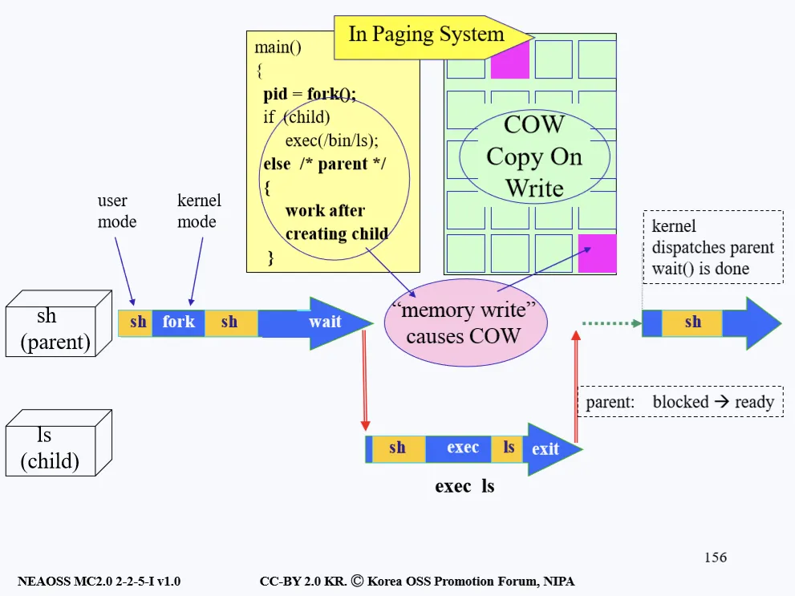
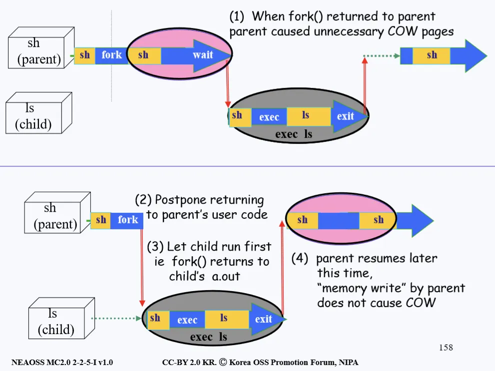

# Process Copy
## 개요
- 지금까지 프로세스가 생성되는 과정에 대해서 알아보았다. 또한 부모 프로세스가 자식 프로세스를 생성할 때 두 가지 오버 헤드가 생긴다는 것을 배웠다. 
- 첫 번째는 PCB를 복사할 때 생기고 두 번째는 image를 복사할 때 생긴다. 
- PCB는 하얀색 도화지의 속성(크기, 질감, 모양)이라면 image는 그 도화지 위에 색칠된 그림이라고 볼 수 있다. 그렇기에 PCB 보다는 image를 복사해오는 오버헤드가 더 크게 발생한다.

## 문제점 발견 (비효율)
- 부모 프로세스한테 ls를 명령하면 바로 자식 프로세스가 자신만의 속성을 갖고 생성되는 것이 아니라, 먼저 부모 프로세스의 상태 정보를 복사하고 그 위에 자식 프로세스가 갖는 속성을 덮어 씌운다. 
- 생각해보면 이런 과정 자체가 너무 비효율적인 과정이라고 생각 할 수도 있다. 어차피 덮어씌울 걸 왜 굳이 부모의 image까지 복사하는 과정이 필요한 것일까.
- 물론 위와 같은 완전한 복사가 항상 비효율적이라는 것은 아니다. 어떤 유저는 부모 프로세스가 가지고 있던걸 정확히 똑같이 복사하고 싶어할 수도 있다. 
- 예를 들어 hwp 문서를 키고 또 똑같은 hwp 문서를 새로 키고 싶어하는 경우도 있을 수 있기 때문이다. 그러나 대부분은 이메일을 키고 거기서 이메일을 쓰는 일을 하듯이 부모 프로세스와는 다른 일 처리를 하는 경우가 대부분이다.

## 해결
- 그래서 고안된 아이디어는 다음과 같다. 모든 코드를 복사해 오는 것이 아니라 페이지 매핑 테이블만 복사해 오는 방법이다.
- 이 방법을 사용하면 자식 프로세스는 image를 부모 프로세스로부터 가져오는 것이 아니라 부모 프로세스의 image를 가리키는 페이지 매핑 테이블만 복사해서 가져오게 된다. 
- 자식 프로세스는 페이지 매핑 테이블을 가지고 execute를 하게 되고 Instruction(실행 명령)을 가져오는 동안에는 부모와 같은 페이지를 쓸 수 있게 된다.

> - 페이지 테이블: 페이징 기법에 사용되는 자료구조로써, 프로세스의 페이지 정보를 저장하고 있는 테이블이다. 테이블 내용은 해당 페이지에 할당된 물리 메모리의 시작 주소를 담고있다.
> - 페이징 기법: 컴퓨터가 메인 메모리에서 사용하기 위해 2차 기억 장치로부터 데이터를 저장하고 검색하는 메모리 관리 기법

## 또다른 문제점과 그에 대한 해결
- 그런데 이렇게 같은 페이지를 사용하다 보면 문제가 생기는 경우가 발생한다. 
- 자식과 부모 프로세스 둘 다 페이지에서 read()해서 데이터를 읽는 건 상관이 없지만, 만약 페이지에 write()를 해서 무언가를 페이지에 쓰게 된다면 어떻게 될까.
- write()를 하는 경우에만 한정해서 그 페이지만 부모와 자식에게 하나씩 복사본을 따로 만들어 주면 된다. 
- 이런 과정을 Copy on Write(COW)라고 부른다. 아래 그림을 살펴보자.

- Copy On Write 방식을 이용하면 처음 시작할 때 자식 프로세스는 페이지 테이블만 가지고 있을뿐 독자적인 image라는 것은 없다. 
- 그러나 부모나 자식 프로세스중 하나라도 페이지에 변화를 주면 그 부분만 각각 복사를 하게 된다.

### 흐름
1. 먼저 부모 프로세스쪽에서 fork()를 하게 된다. 
2. 부모 프로세스 정보를 전부 복사하는 것이 아니라 COW 방식으로 페이지 테이블만 복사해 가져온다. 
3. 그리고 나서 fork()를 했던 곳으로 돌아온다. 
4. 그리고 나서 wait() 시스템 콜을 호출해서 CPU를 자식 프로세스에게 넘겨주려 할 것이다. 
5. 그럼 CPU가 자식 프로세스에게 넘어가서 자식도 fork()로부터 리턴해서 자식 프로세스만의 작업들을 수행할 것이다. 
6. 이 때, 자식이 페이지를 읽어오는 것은 상관 없지만 write()를 하게 되면 그 페이지에 대해서만 복사를 한다.
7. 그런데 보통 자식 프로세스는 fork()에서 돌아오면 거의 바로 exec()을 하게 된다. 즉, 전에 부모 프로세스의 이미지를 복사 했든 안했든 자신만의 이미지(코드)로 싹 갈아엎는다. 
8. 부모 프로세스가 fork()를 하고 난 뒤 돌아오고나서 문제가 생긴다. 
9. 부모 프로세스가 fork()에서 돌아와서 바로 wait()를 안하고 다른 일을 처리할 경우 3분의 1 정도는 보통 write()의 기능을 한다. 그 말인 즉슨 자식 프로세스가 CPU를 점유하기 전에 페이지 테이블에 계속 변화가 발생하게 되는 것이다.
10. 이런 행위는 계속해서 Copy On Write를 하게 될 것이고 이렇게 복사 된 값들은 사실 자식 프로세스가 exec()을 하게 되면 어차피 덮어 씌워지기 때문에 결국에는 의미없는 복사를 하는게 된다. 
11. 그렇다면 어떻게 하는 것이 효율적인 방법일까. 아래 그림을 살펴보자.

### 효율적인 방향

- 그림의 위쪽 부분은 위에서 설명한 불필요한 COW가 발생하는 경우를 나타낸 것이다. 
- fork()로 돌아온 부모 프로세스가 자식 프로세스에게 wait()으로 CPU를 넘겨줄 때 까지 계속해서 의미없는 COW를 만들어 내고 있는 그림이다.

#### 비효율의 해결 방법
1. 부모 프로세스가 fork()를 호출해서 자식 생성을 끝내고 fork()를 했던 곳으로 돌아가려 한다. 즉 커널에서 유저모드로 돌아가려 하고 있다.
2. 이 때 fork() 안에서 자식 프로세스의 CPU 우선 순위를 확 높여버린다. 이렇게 우선순위를 높이는 이유는 커널에서 유저모드로 돌아갈 때에는 우선순위가 제일 높은 프로세스한테 CPU를 넘겨주기 때문이다.
3. 이렇게 되면 CPU가 부모한테 돌아가는 것이 아니라 자식 프로세스한테 가게 된다. 이렇게 CPU를 받은 자식 프로세스는 바로 exec()을 하게 되고 CPU를 다 쓰게 되면 exit()으로 CPU를 다음 순서로 넘겨주게 된다.
4. 그럼 이제 부모 프로세스가 CPU를 받게되고 fork()에서 돌아오고 본인이 할 일을 하게된다.

