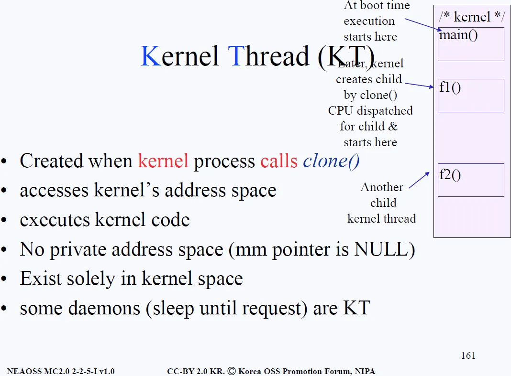
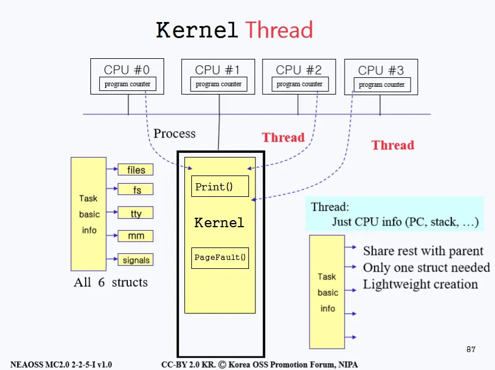

# Kernel Thread (커널 스레드)
## 지난 학습
- 프로세스는 부모의 것(Task basic info + files, fs, tty, mm, signals)을 전부 그대로 복사한 것(heavy-weight creation)이고, 반대로 최소한으로 복사(light-weight creation)한 것이 스레드이다.
- 커널은 메모리 상주 프로그램(memory resident program)이다. 
- main() 함수가 있는 평범한 프로그램의 특성 + 부팅할 때 부터 메모리에 올라와서 컴퓨터의 전원을 완전히 차단할 때까지 메모리에 상주한다는 특성을 함께 가지고 있다.

- 위 그림의 우측 보라색으로 칠해진 부분은 커널영역을 의미한다. 컴퓨터가 맨 처음 부팅(booting)하면 분명 커널의 main()부터 실행할 것이다. 
- 그 후 커널 프로세스가 동작하던 중 커널 프로세스 내에서 시스템 콜 clone()을 호출하게 되면 자식 프로세스가 생기는데, 이때 부모 프로세스가 가리키는 PC(Program Counter)와 자식 프로세스가 가리키는 PC는 각각 다른 곳을 가리키고 있을 수 있다.
- 그래서 만약 CPU 코어가 3개가 있다고 한다면, 각 CPU 코어의 PC는 main()과 f1()과 f2()를 가리키고 있을 수 있다(CPU dispatched for child & starts here). 그렇게 만들어진 자식 프로세스를 커널 스레드라 한다. 
- 이는 자식 프로세스들이 커널 코드를 실행(execute)하고 있기 때문이다. 대부분의 경우 이런 함수들은 서버(server) 혹은 데몬(daemon)이다.

- 서버와 데몬의 알고리즘은 기본적으로 무한 루프(endless loop)라고 배웠다. 또한 서버와 데몬은 대부분의 시간을 자면서(sleep) 보낸다. 
- 그러다 요청(request)이 오면 깨어나 그 작업을 처리해주고 또 잔다. 네트워크와 관련된 작업을 처리하는 데몬이라면 네트워크 서버라고 부를 수 있고, 만약 프린트 요청을 기다리고 있다면 프린트 서버라고 할 수 있다.

- 결국 커널 스레드는 커널 프로세스가 clone()을 호출해서 light weight overhead로 자식을 만들어준 것이다. 또한 커널 메모리 영역과 코드를 똑같이 접근하고, 커널 코드를 실행한다. 
- 당연하게도 커널 스레드는 커널 영역에만 존재한다. 많은 데몬(웹 서버, 프린트 등)들이 커널 스레드이다.

- 위 그림을 보면 CPU가 여러 개 있고 CPU 마다 PC(Program Counter)를 가지고 있다. 지금은 PC가 커널을 가리키고 있다. 
- 여기서 커널이 clone()을 통하여 스레드 2개를 만들어줬다고 가정해보자. 
- CPU #2에 할당된 것은 프린트 데몬(서버)이고, #3에 할당된 것은 PageFault 데몬이다. 
- 앞 장에서 다뤘듯 스레드는 위 그림의 우측 노란박스에 해당하는 Task basic info 파트만 복사를 하고 나머진 부모 프로세스와 공유를 한다.

- Task basic info 안에는 state vector save area가 존재하기 때문에 각 스레드마다 별도의 Program Counter와 Stack Pointer를 갖고 있을 수 있는 것이다. 
- 각 스레드가 각자의 Stack을 갖고 있기 때문에 개별적으로 커널 내의 다른 함수들을 호출하면서 실행될 수가 있다.
