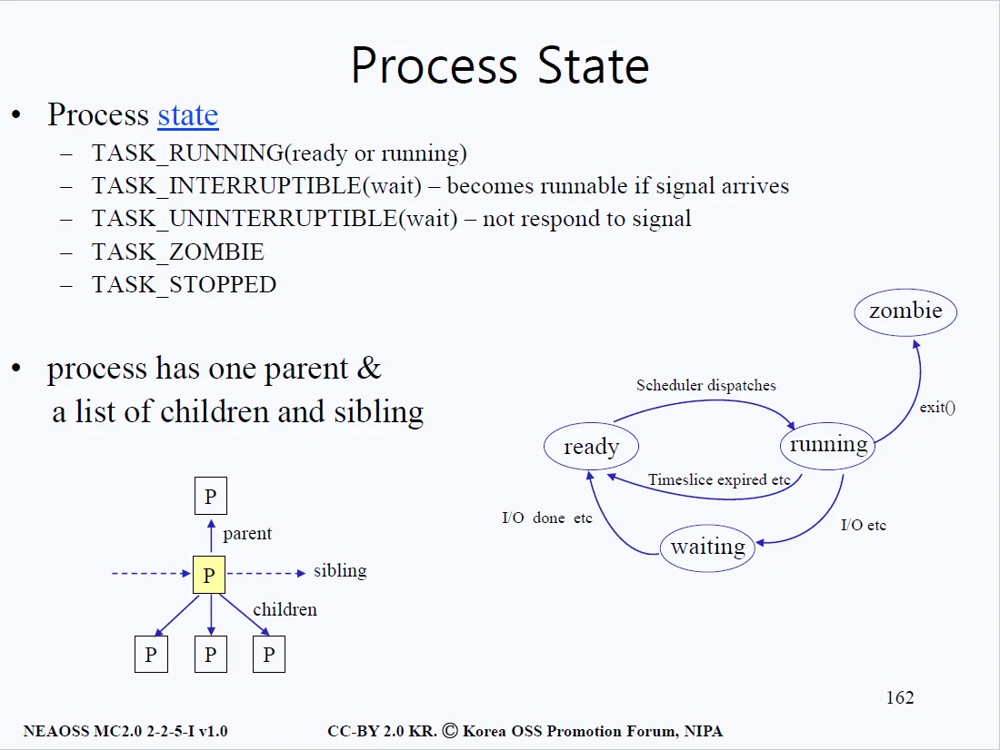

# Process State
- 프로세스의 상태에는 ready, running, waiting이 존재한다. 
- running은 프로세스 입장에서는 최상의 상태이며, running 중 Disk I/O를 요구하는 사건이 발생하면 CPU가 해당 프로세스의 상태를 waiting으로 바꾼다. 
- waiting의 경우 시그널의 상황에 따라 두 가지의 반응이 있을 수 있는데 이 부분은 중요한 내용은 아니다.

## 흐름
#### 1번
- I/O가 끝나고 상태는 wait에서 ready로 넘어가게 된다(CPU는 항상 바쁘다). I/O가 끝나고 ready list에 참여해서 기다리다 보면 차례가 오게 된다. 
- 차례가 오는 것을 Scheduler dispatches라고 표현한다. dispatch 과정을 상세하게 풀어보자면, context_switch()의 동작으로 설명할 수 있다.

#### 2번
- 첫번째로 현재 사용중이던 프로세스의 state vector를 저장한다. 
- run 하고싶은 프로세스의 state vector를 CPU에 로드한 후, Program Counter가 가리키는 곳으로 가는 것이 dispatch의 과정이다.

#### 3번
- CPU가 주어지면 어느 정도의 시간(time slice)만큼만 동작하고 시간이 끝나면 다시 ready list로 가는 구조인데, 일단 프로세스가 성공적으로 exit()했다고 가정해보자. 
- 프로세스가 exit()을 하게 되면 zombie 상태가 된다.

#### 4번
- 좀비 상태라는 것은 a.out도 날라가고 file도 전부 closed되고 메인 메모리도 다 뺏기고, PCB만 남은 상태를 의미한다. 
- 왜 PCB가 남아있는 것일까?

#### 5번
- 만약 부모 프로세스(parent)가 지금까지 기다리고 있었으면, parent가 깨어나 CPU를 쥐고 실행될 것이다. 
- 이 때 parent는 자신이 잘 동안 child가 뭘 했는지, 디스크와 CPU를 얼마나 썼는지, 제대로 끝났는지 등에 대한 내용을 child의 PCB에서 확인한다.

#### 6번
- 위와 같은 중요한 정보들이 PCB에 있기 때문에 PCB는 남겨둬야 한다. 따라서 자식 프로세스의 PCB는 부모 프로세스가 말소시키는 것이 맞다. 
- parent가 말소시킬 때까지는 자식은 zombie상태인 것이다. 따라서 최상위 부모 프로세스는 자식 프로세스들이 사용한 모든 자원을 전부 파악할 수 있어야 한다.
