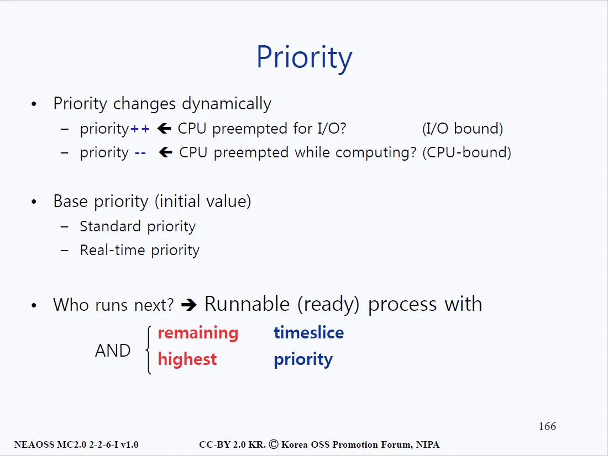
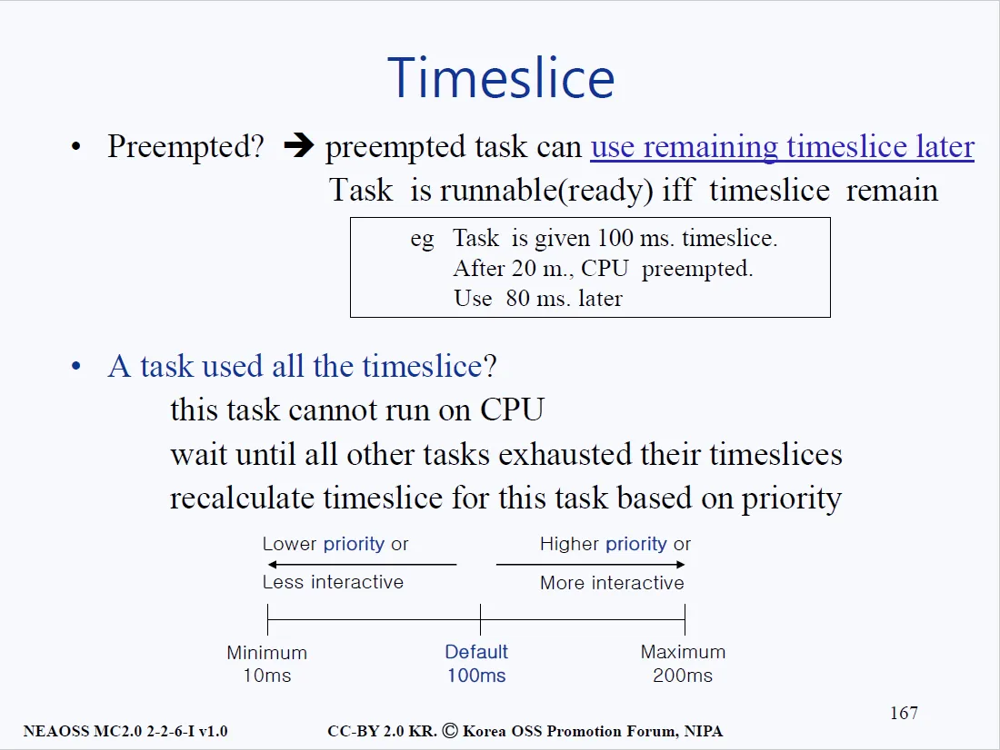
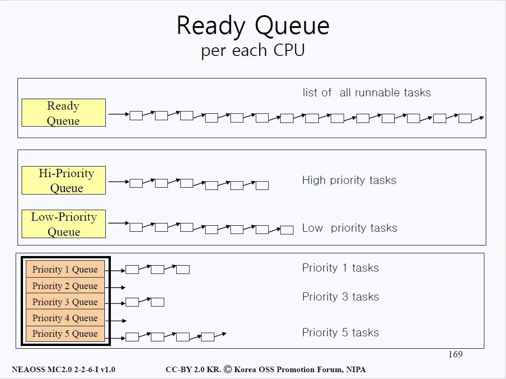
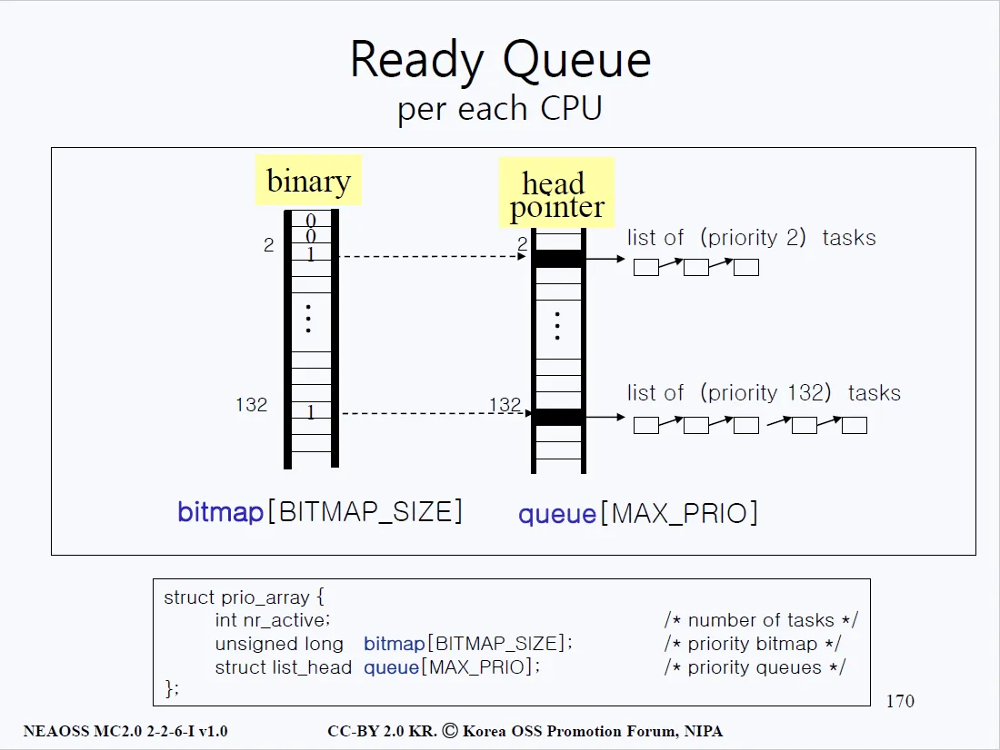
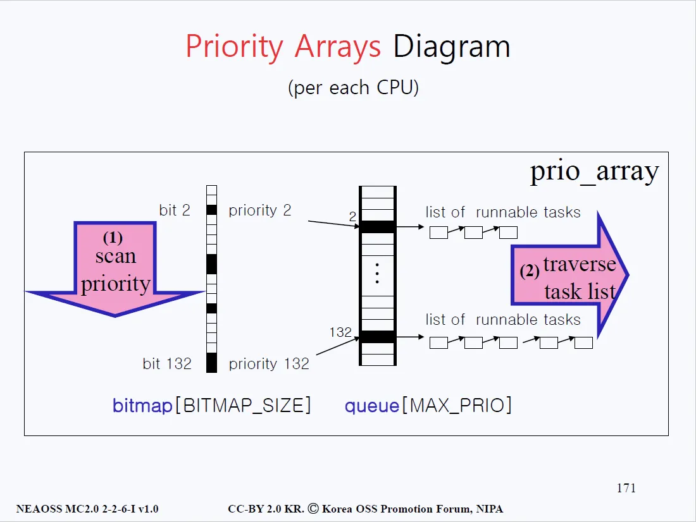
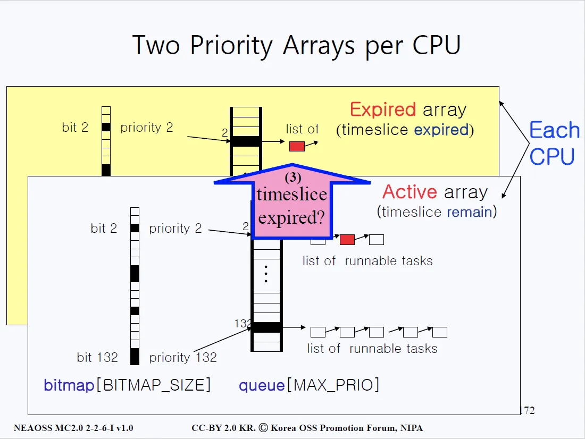
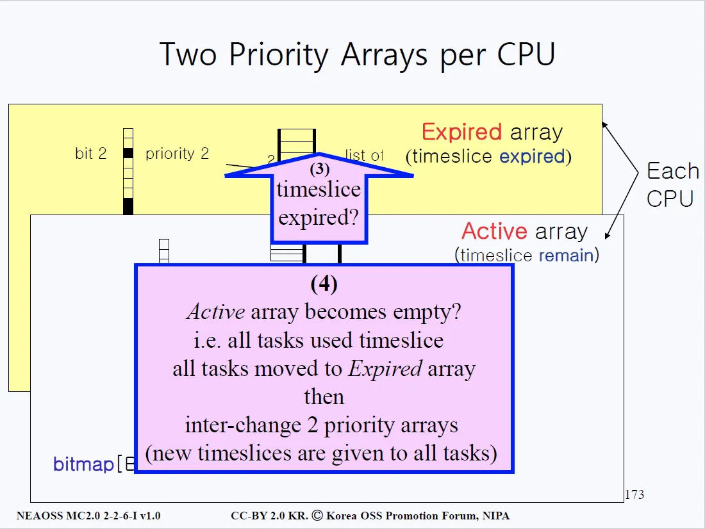
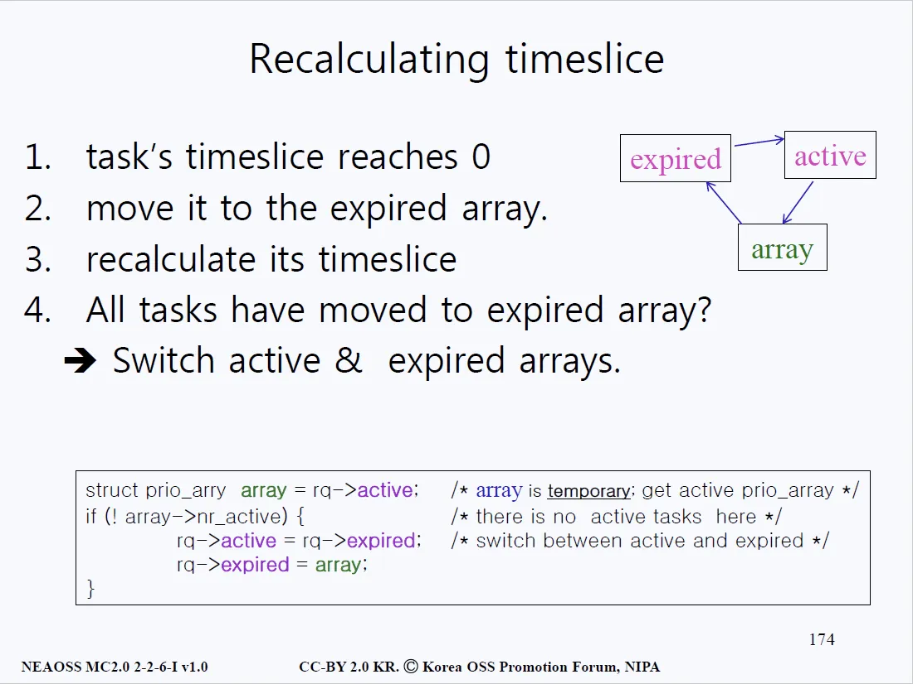

# Kernel Scheduling (커널 스케줄링)

## 개요

- 리눅스에서는 어떤 프로세스가 다음에 실행될 프로세스일까? 물론 priority(우선순위)가 가장 큰 프로세스가 실행될 것이다. 
- 하지만, time slice를 가지고 있는지도 반드시 확인해야 한다.

## Time Slice

- 먼저 위쪽 네모박스 안의 내용을 살펴보자. CPU가 어떤 프로세스에게 할당될 때는 일종의 시간 제한이 있게 된다. 위 예시에서는 100ms라고 되어 있다. 
- 하지만 안타깝게도 이것마저도 못쓰게 되는 경우가 발생할 수 있다. 현재 프로세스보다도 더 급한 작업이 요구되었을 때, CPU를 또 다시 빼앗길 수 있다.
- 위 네모박스 안에서는 20ms를 사용하다가 CPU를 뺏겨버렸고 남은 80ms는 추후에 다시 CPU를 받았을 때 사용해야 한다. 여기서 남은 80ms를 remaining timeslice라고 한다.
- 즉, 리눅스에서 프로세스가 CPU를 차지하기 위해서는 우선순위가 높아야 하고 남은 타임 슬라이스가 0보다 커야 한다. 

## 스케줄링이 이루어지는 과정

### 첫 번째
- 먼저 맨 위의 레디큐(Ready Queue)를 살펴보자. 레디큐에는 PCB가 여러 개 들어 있다. 바로 실행(run)할 수 있는 작업들이 쭈욱 연결되어 있는 것이다.
- 이런 구조에서의 문제점은 멀티프로세서 시스템이 돼서 CPU의 갯수가 증가하게 되면 연결된 머신의 수에 따라 레디큐에 연결되는 PCB도 기하급수적으로 많아질 것이라는 데 있다. 
- 500개의 프로세스가 돌고 있다고 가정한다면, context_switch()를 실행할 때마다 이 500개에 해당하는 레디큐의 내용을 전부 뒤져서 우선순위가 높은 프로세스를 골라내야 하는데, 탐색 작업이 상당히 비효율적(시간이 오래걸림)이라는 문제가 생긴다.

### 두 번째
- 그래서 이번에는 위 그림의 중간에 있는 구조(큐를 두 개로 나눈 구조)로 설계를 해 보았다. 하나의 레디큐로 두는 것은 탐색하는데 비효율적이라고 생각으로부터 나온 설계다. 
- 높은 우선순위와 낮은 우선순위를 가지는 두 개의 큐를 제작했다. 
- 하나의 큐 보다는 확실히 효율적이겠지만, 이마저도 만족스럽지 않기에 위 그림의 맨 아래와 같은 설계(여러 개의 큐를 두는 구조)를 해봤다. 

### 세 번째
- 좀 더 분류를 세분화해서 여러 개의 큐를 만들었다. 각 큐는 PCB를 가리키는 포인터로 이루어져 있다.
- 하지만 주황색으로 구현된 큐를 보니 중간 중간 비어 있는 큐(2번과 4번 큐)도 보인다. 이러한 큐까지 탐색할 필요는 없으니 좀 더 효율적으로 탐색을 해볼 수 있지 않을까? 라는 생각을 할 수 있다.

## 해당 우선순위에 해당하는 큐가 비었는지 안 비었는지를 체크할 수 있는 비트 배열

- 위 그림의 좌측에는 바이너리 배열이 하나 있는데, 0은 해당 인덱스의 포인터를 따라가면 해당 인덱스의 큐가 비어 있다는 뜻이고 1이라면 해당 인덱스의 큐에 내용물이 있다는 뜻이다. 유닉스에서는 이 바이너리 배열을 비트맵이라 부른다.
- 이렇게 비트로 된 배열을 사용함으로써 탐색 속도가 향상될 수 있다. 이 비트맵의 인덱스가 얼마나 존재하는지가 시스템에서 다루는 난이도가 얼마나 세분화되어 있는지를 나타낸다. 
- 132개의 인덱스가 존재한다고 가정한다면, 우선순위가 132개로 나뉘어진다는 뜻이다. 우측에는 큐로 이루어진 배열이 그 구현체다. 해당 큐의 각 내용물은 PCB로 이루어져 있다.
- 위 그림의 맨 밑을 보면 구조체가 하나 존재한다. 그 구조체 안에는 비트맵과 큐 배열이 존재한다. 
- 멀티프로세서 시스템에서 CPU가 10개 있다고 한다면, 이 구조체가 각 CPU마다 존재한다고 생각하면 된다. 비트맵과 큐 배열을 함께 포함하고 있는 구조체가 바로 priority array(우선순위 배열)이다.

## 우선순위 배열

