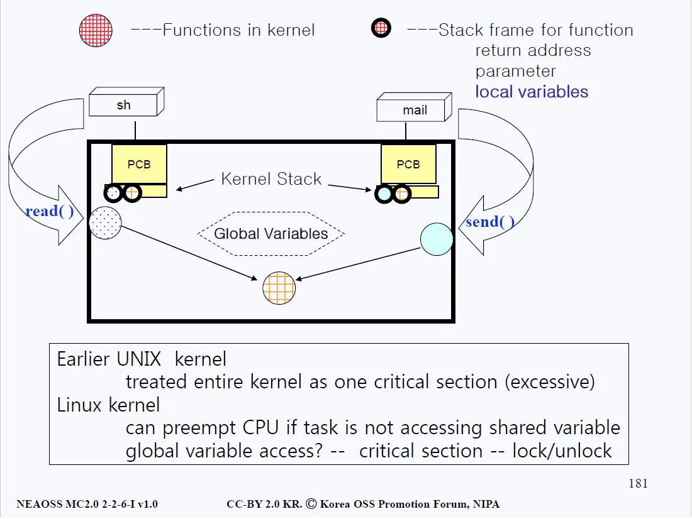

# Kernel Preemption

## 상호 배제 (Mutual Exclusion)

- 컴퓨터 시스템을 얘기할 때 가장 중요한 파트 중 하나가 상호 배제 문제이다. 시스템이 정상적으로 작동하기 위해서는 이 상호 배제 개념은 반드시 필요하다.
- 설명을 진행하기 전, 먼저 X++ 라는 연산이 정확하게 어떻게 이루어져 있는지부터 이해하고 가자. 
- 우리가 보통 프로그래밍 언어를 사용할 때 X++과 같은 단항연산자를 사용하면, 하나의 명령만으로 덧셈이 정상적으로 이루어지는 것 같지만 실제로 동작하는 기계 입장에서 이 단항연산 과정은 3단계로 나누어진다. 그 과정은 아래와 같다.

### X++ 과정
1. X를 저장소로부터 읽어서 CPU 레지스터로 읽어들인다.
2. CPU 안에서 ALU 연산을 진행한다.
3. CPU 로부터 나온 결과를 다시 저장소에 쓴다.

- 우리가 흔히 사용하는 X와 같은 변수 또는 데이터는 항상 저장소(storage)에 존재한다. 
- CPU 안에는 저장시킬 수 있는 용량이 얼마 없고 또 비싸기 때문에 CPU 안에 많은 변수와 데이터를 저장할 수는 없다. 
- 때문에 우리가 흔히 알고 있는 컴퓨터 시스템에서 데이터는 저장소에 저장되고 연산은 CPU에서 이루어지게 되는 것이다. 이 개념을 먼저 숙지한 후 아래의 그림과 함께 설명을 보자.

### Critical Section

#### 성공 케이스
- 위 그림을 보면 두 개의 프로세스가 존재하고, 이 두 프로세스는 한 개의 변수 X를 공유하고 있다. 
- 프로세스 A가 먼저 X에 대한 X++를 연산한 후 메모리에 저장하고, 그 다음 우측의 프로세스 B가 변수 X를 레지스터로 읽어들여 연산처리를 한 후 디스크에 저장한다. 
- 이렇게만 한다면, X라는 변수는 정상적으로 11 -> 12 -> 13순으로 디스크에 저장될 것이다.

#### 실패 케이스
- 그런데 만약 이 두 프로세스가 X를 동시에 읽어들여 연산할 경우에는 문제가 발생하게 된다. 
- A가 X를 읽은 후에 ++연산을 진행하는 도중 B가 X를 읽어들였다고 가정해보자. 
- A는 아직 더한 값을 디스크에 쓰지 않았기 때문에 아직 X는 초기값 11 그대로다. 따라서 B가 읽어들인 X값은 11이다.
- 여기서 A가 값을 12로 증가시킨 후 디스크에 12를 기록했다고 해도, 결국 B또한 12로 증가시킨 후에 기록하기 때문에 덧셈은 한 번밖에 일어나지 않는다. 두 번의 덧셈연산이 제대로 동작하지 않은 것이다. 

__이처럼 프로세스 간 공유된 변수를 접근하는 부분을 Critical Section이라 부른다.__

### 상호 배제 원칙
- 크리티컬 섹션에는 하나의 프로세스만 접근해야만 한다. 그래야 위와 같은 오류가 발생하지 않는다. 
- 이러한 원칙이 바로 상호 배제(Mutual Exclusion)의 원칙이다. 크리티컬 세션은 하나의 프로세스만 접근이 가능하다. 또 그래야만 한다.

## 구체적 방법
- 유닉스는 지난 40년간 이러한 문제를 어떻게 해결했을까? 그 방법은 매우 단순하게도, 커널모드인 경우에는 CPU를 뺏지 않고 유저모드일 경우에만 CPU를 뺏는다. 커널에 있을 때는 CPU preemption을 고려하지 않아도 된다.
- 하지만 이러한 설계에는 문제가 있다. 중요한 작업이 도중에 발생했다고 해도, Kernel 모드이기 때문에 CPU를 다른 곳에 할당하지 못한다면 리얼타임 시스템(real-time system)과 같이 빠른 처리와 빠른 전환이 어려워진다. 
- 커널이 작업 중임에도 CPU를 가져올 수 있어야 진정한 리얼타임 시스템이 가능하다. 이 부분을 어떻게 해결할지가 아래 그림에 나와있다.

### 리눅스의 리얼타임 시스템

- 위 그림의 좌측 상단을 보면, 쉘(sh)이 read() 시스템 콜을 호출하고 있다. 함수 안에 변수들이 쓰이면서 스택에 이러한 변수들이 담기게 된다. 우측의 mail 프로그램에서도 send() 시스템 콜을 호출하고, 이 호출 또한 지역변수를 자신만의 스택에 담는다. 그러나 둘은 같은 공용 변수에 접근하고 있다. 어떻게 하면 두 프로세스가 원활하게 동작이 가능할까?

리눅스에서는 공용 변수에 접근할 때만 따로 lock을 건다. 접근이 끝났다면 unlock을 한다. 즉, lock이 되어 있다면 커널모드이건 아니건 CPU를 뺐는 일은 발생하지 않는다. 그러나 unlock이라면 크리티컬 세션이 아닌 것이므로 커널 모드임에도 CPU를 다른 프로세스에게 할당하는 것이 가능하다. 리얼타임시스템을 고려한 리눅스에서의 설계다.

- 위의 preempt_count가 lock의 갯수이다. CPU를 뺏으러 왔을 때, preempt_count가 0이면 공용 변수에 접근하는 프로세스가 하나도 없다는 것이기 때문에 CPU를 뺏을 수 있다. 
- need_resched의 경우는 리얼타임 시스템이 CPU를 다른 프로세스에 할당해주기 위해 왔는데, preempt_count가 0이 아니여서 뺏을 수는 없으니 "지금 다른 우선순위 높은 프로세스가 CPU를 기다리고 있어!"라는 표시를 해주는 용도로 사용한다. 
- 따라서 preempt_count가 0으로 되고 need_resched 플래그가 세트되어 있다면, 현재 공용변수에 접근하고 있는 것이 없으니 CPU를 다른 프로세스에게 할당해도 좋다는 의미가 된다.

