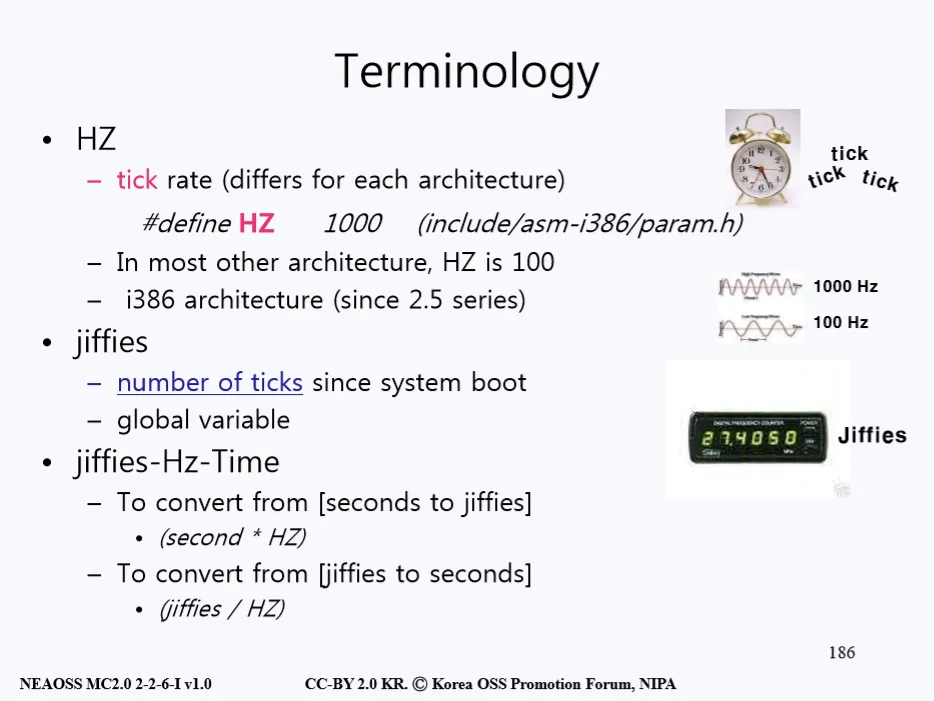

# 타이머와 시간 관리
- #define HZ 1000이라는 표현을 사용하면 1초에 1000번 인터럽트가 걸리는 설정으로 된다. 대부분의 경우에는 100을 걸어 놓는다.

<p align="center"></p>

- 시스템이 켜진(부팅된)이후에 몇 번 tick을 했는지 기록한 것을 우리는 Jiffies라고 표현을 한다. 
- 이는 전역 변수이며 카운터의 역할을 한다. 이러한 Jiffies를 설정된 HZ로 나누면 몇 초가 흘렀는지 알 수 있다.

```
예시: Jiffies가 24000이고 HZ가 100으로 설정되어 있었다면 
    24000/100 즉 시스템이 부팅된 이후 240초가 흘렀다는 것을 알 수 있다.
```

- 위에서 우리는 HZ의 단위로 인터럽트를 걸기 위해 이러한 시간 개념을 도입했다는 것을 살펴봤다. 
- 그렇다면 왜 1초에 100번씩이나 인터럽트가 걸려야 하는 것일까, 왜 I/O 인터럽트처럼 어떤 입력이나 할 일이 생겼을 때만 인터럽트를 하면 되는 것 아닐까라는 의문을 품을 수 있을 것이다.

## 시간 단위를 도입한 이유
- 시스템에 시간 단위를 도입한 이유는 먼저 특정 시간마다 반복이 필요한 일들을 처리하려면 시스템이 시간의 개념을 알아야 하기 때문이다. 
- 사실 가장 중요한 이유는 스케쥴링에 필요하다는 점이다. 프로세스들은 CPU를 사용할 수 있는 시간인 Timeslice를 배정받게 된다.

- 이 때, 얼마만큼의 시간이 지났는지 파악해 다음 작업에 CPU를 넘겨주는 등의 역할을 할때 시간의 단위를 사용하게 된다. 
- 즉, 하나의 작업이 다 끝날때까지 다음 작업이 기다리는 것이 아닌 HZ의 단위로 계속해서 프로세스들이 돌아가며 작업을 할 수 있게 해주기 위해 계속해서 특정 시간마다 인터럽트를 걸어주는 것이다.

- 그렇다면 이런 인터럽트의 횟수를 100에서 1000번을 하게 HZ를 설정하면 좋은 것일까? 꼭 그렇지만은 않다. 
- 물론 인터럽트 하는 주기가 늘어났기에 반응을 하는 횟수는 증가할 수 있다. 
- 그러나 많은 인터럽트를 하면서 오버헤드가 증가하기 때문에 현재 쓰는 장치들은 대부분 100HZ 라는 적절한 숫자로 설정해 준 것이다.

## Timer와 Real-Time Clock(RTC)
<p align="center"></p>

- 이러한 시스템의 시간은 크게 Timer와 Real-Time Clock(RTC) 2가지로 나눌 수 있다. 

### Timer
- 먼저 Timer는 주기적으로 CPU에게 인터럽트를 거는 역할을 한다. 이러한 Timer는 프로그램적으로 인터럽트를 걸 수 있게 설정할 수도 있다.

### Real-Time Clock(RTC)
- Real-Time Clock은 현실 세계의 시간을 표현하며 PC의 전원을 꺼놔도 보조 배터리를 통해 계속해서 현재 시간을 측정 한다. 
- 후에 다시 PC를 켰을 때 시스템은 Real-Time Clock의 시간을 보고 현재 시간을 표시한다. 
- 그렇다면 이제 이런 타이머 인터럽트를 관리하는 핸들러의 실제 구현을 아래 그림과 함께 알아보자.

<p align="center"></p>

- 먼저 인터럽트가 걸리면 do_timer(struct pt_regs \*regs)로 들어와 Jiffies를 하나 증가시키게 된다. 
- 이 때 Jiffies는 시스템이 켜진 이후 매번 카운트를 하는 역할을 함으로 64비트라는 매우 큰 크기로 정해준다. 
- 그 후에 update_process_times(user_mode(regs))를 통해 몇 번이나 인터럽트가 걸렸는지 업데이트를 하는데 이 때, 인터럽트가 걸린 순간에 User 모드였는지 Kernel 모드였는지 기록을 한다.
- 이러한 타이머는 프로그램으로 특정 시간으로 설정할 수도 있으며 지연시킬 수도 있다는 정도만 알아두고 이런 타이머에 의해 걸리는 인터럽트에 대해 자세히 알아보자.
