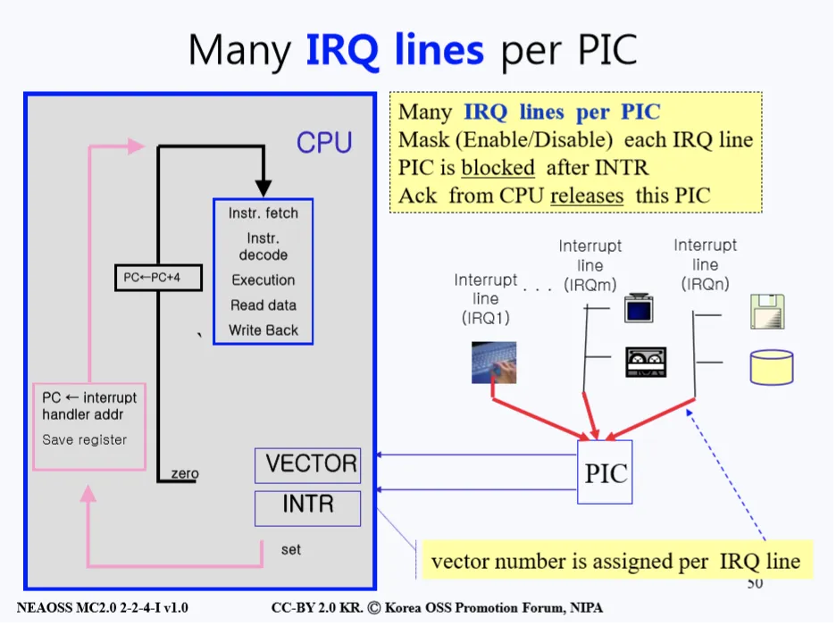

# 인터럽트 (Interrupt)
> CPU가 프로그램을 실행하고 있을 때, 입출력 하드웨어나 예외 상황 등이 발생해 작업을 처리가 필요할 경우에 커널에게 처리해 달라고 요청하는 것

## CPU
- CPU는 먼저 인스트럭션을 가져온다. 그리고 그 인스트럭션을 분석하고 실행을 한다. 
- 이렇게 실행을 하기 위해선 데이터를 읽어와야 하는 경우도 종종 있게 된다. 또한 연산을 처리 했다면 처리된 결과를 반환해준다. 
- 인스트럭션이 다 끝났으면 그 다음 인스트럭션을 가져오기 위해 프로그램 카운터를 증가시킨다. (보통은 4 byte 정도 증가시킨다)

- 이런 일련의 작업을 하던 중 Disk가 인터럽트를 걸었다고 생각해보자. 그러면 Interrupt Request Bit 하나를 설정한다. 
- 이 비트가 걸려있으면 작업을 계속 돌지 않고 프로그램 카운터에 인터럽트 핸들러의 새로운 주소를 저장한다. 
- 그리고 다시 진행을 해서 인스트럭션을 가져오면 아까 저장했던 인스트럭션을 가져와 점프한 효과를 보게된다. 
- 물론 이런 인터럽트가 걸리지 않게끔 설정할 수도 있다. 예를 들어 컴퓨터를 부팅할 때의 경우엔 Interrupt Request Bit 설정을 disable 시켜서 인터럽트 당하지 않게 만들 수 있다.

- 위의 경우는 디스크 하나만 인터럽트를 걸었을 경우에 대한 설명이었고, 아래 그림은 인터럽트를 거는 장치들이 많을 때의 상황을 설명한다.

### Interrupt Controller

- 여러 개의 장치가 인터럽트를 거는 것을 통제하기 위해 Interrupt Controller라는 개념을 도입했다. 
- 우리는 이런 Interrupt Controller를 PIC(Programmable Interrupt Controller)라고 부른다. 
- 여기서 Programmable 이 붙는 이유는 소프트웨어적으로 관리가 가능하기 때문에 프로그램이 가능하다는 뜻이 붙은 것이다.

## PIC (Programmable Interrupt Controller)

- PIC에서는 여러 개의 장치들이 인터럽트 요청을 한다. 이 때 요청을 한 장치들은 Interrupt Request Line(IRQ Line)에 연결이 된다. 
- 이렇게 요청이 들어온 요청 라인들은 Mask Register을 통해서 0일 경우 차단이 되고 0이 아닐 경우엔 그 다음 단계로 통과가 된다. 이러한 Masking은 소프트웨어적으로 차단할 장치등을 설정할 수 있다. 
- 그 후에 Interrupt Request Register에서 Masking이 되지 않은 장치들만 요청을 할 수 있게 설정해 주는 단계를 거친다.

- 이렇게 설정이 된 요청들 중 우선순위가 제일 높은 요청을 Priority Register에서 받고 지금 인터럽트 요청이 진행 중 이라고 In Service Register에 등록하고 INTR, 즉 CPU에게 인터럽트 요청을 한다.
- 이 때, 어떤 IRQ Line에서 요청이 들어온건지를 Vector에 넣어 보낸다. 
- 그렇게 요청을 보내고 나서 CPU가 요청을 처리 했다는 ACK 신호를 보낼 때 까지 다른 PIC와 장치들은 차단되어 있다. 이러한 요청 처리 단계를 위해 CPU는 빠르게 일들을 처리해 줘야 한다.

- 지금까지 설명한 요청 단계를 정리해 보면 위의 그림과 같이 나온다. 
- PIC가 INTR과 Vector을 CPU에게 보내고 그럼 Interrupt Request Bit을 설정한다.
- 그걸 본 CPU는 그 요청을 처리할 새로운 공간을 만들어 일을 처리한 후 ACK를 다시 PIC에게 보낸다.
- 그러는 동안 요청을 보낸 PIC은 ACK가 올 때까지 다른 요청들을 차단하고 기다린다.

## SMP & AMP
> 여러 요청들이 멀티 프로세싱 환경에서는 어떻게 처리되는가.

- 먼저 CPU 2개가 있고 이 CPU가 bus에 달려있다고 하자. 그리고 모든 I/O 장치들은 multi APIC(Advanced Pic)에 달려있다. 
- APIC 란 멀티 프로세서를 위한 PIC이다. 
- 또 다른 APIC는 각각의 CPU에 달려있는데 작은 PIC들은 Local APIC이라 하며 여기에는 정기적으로 인터럽트를 걸어주는 Timer만 달려있다.

### 컴퓨터 구조

- CPU가 0000000~7777XXX번 메모리를 메모리 관리 유닛에게 보내면 위 그림의 좌측 Memory 쪽으로 달려간다. 그러나 7777XXX ~ 7777777번 메모리를 유닛에게 보내면 I/O Interface쪽으로 버스를 타고 달려간다.
- I/O 버스들에는 각각 I/O 장치들이 연결되어 있는데 이런 장치들은 컴퓨터 뒤에 보면 있는 각종 연결장치, 즉 I/O Interface Card들로 연결이 되어있다. 
- 이런 I/O Interface Card의 구조는 Address, Data와 보조 레지스터인 Control, Status 등으로 구성되어 있다. 
- 그 외에 장치를 만든 회사 이름, 모델 아이디 등등이 들어있으며 어느 카드에 꽂혀있는 장치인지 등에 대한 정보도 들어있다. 
- 이러한 인터페이스를 바탕으로 위 그림의 오른쪽처럼 각종 장치들이 인터페이스 카드들에 연결되어 있는 것이다.

### SMP
> 두 개 이상의 동일한 프로세서가 하나의 메모리, I/O 디바이스, 인터럽트 등의 자원을 공유하여 단일 시스템 버스를 통해 각각의 프로세서는 다른 프로그램을 실행하고 다른 데이터를 처리하는 시스템

- 두 개 이상의 프로세서가 하나의 컴퓨터 시스템을 공유하도록 연결되어 있으며, 각각의 프로세서가 독립적으로 자신의 작업을 처리하는 방식이다. 
- 이러한 방식에서 디바이스가 I/O 인터페이스 카드에 연결이 되어 요청을 보내면 APIC이 받아 처리를 하는데 CPU 간의 차이가 없는 대칭형이기 때문에 어느 CPU에 요청을 전달하는지는 다음과 같은 두 가지 방식을 사용한다.

#### Static Distribution
- 정적으로 정해진 곳에 보낸다. 이 경우에는 이미 만들어진 Static Table을 통해 결정을 하게 된다.

#### Dynamic Distribution
- 동적으로 결정을 하는데 이 때 동적 IRQ 분배 알고리즘을 통해 보낼 곳을 정한다. 
- 이 알고리즘의 목표는 우선순위가 제일 낮은 프로세스를 처리하고 있는 CPU에게 IRQ를 주는것이다.

#### 프로세스를 실행하고 있는 경우
- 이를 해결하기 위해 모든 프로세스에 카운터를 둔다. 
- 이 카운터의 값이 가장 큰 CPU가 IRQ를 받게 되는데 이때 카운터를 0으로 낮춰주고 IRQ를 받지 않은 다른 모든 CPU의 카운터는 증가시킨다. 
- 이렇게 카운터를 증가시킴으로서 나중에 어떤 CPU가 IRQ를 제일 적게 받아 제일 처리를 많이 안했는지 분별할 수 있는 척도로 사용을 하게된다.

### AMP
> 두 개 이상의 각각의 프로세서가 자신만의 다른 특정 기능을 수행하는 방식

- 예를 들어, 하나의 프로세서가 메인 운영체제를 실행하도록 하고 다른 프로세서는 I/O 기능을 전용으로 수행하는 형식 등을 말한다. 
- 이런 구조에서 IRQ를 처리하는 방식이 위 그림에 나와있다. 
- 각각의 CPU가 다른 작업들을 하고 있다. 이때 Master CPU는 본인만의 메모리를 가지고 있는데 여기 OS 커널이 들어있다.
- 즉, Master CPU만 I/O 인스트럭션을 가지고 있는 구조이기에 다른 CPU가 I/O를 하려면 Master CPU에게 신호를 보내야 한다. 이러한 주종 관계라는 간단한 구조 덕분에 디자인이 쉽다.
- 그러나 Master CPU에게 시스템 콜 요청이 많아지면 과부화가 쉽게 걸리며 Master CPU가 망가지면 아무것도 할 수 없기 때문에 문제가 생긴다. 
- 과거에는 AMP 방식만 사용하다 처리 방식이 발전이 되어 SMP로 바뀌었다.

